# Agent Identity in Microsoft Foundry Agent Service

This document explains how [agent identities](https://learn.microsoft.com/azure/ai-foundry/agents/concepts/agent-identity) work in [Microsoft Foundry Agent Service](https://learn.microsoft.com/azure/foundry/agents/overview), how they integrate with [Microsoft Entra ID](https://learn.microsoft.com/entra/fundamentals/what-is-entra), and how tokens flow from an authenticated user through an application to the agent and on to backend tools. It is intended as a single reference for building sample applications that demonstrate and experiment with Agent Identity.

> [!NOTE]
> [Microsoft Entra Agent ID](https://learn.microsoft.com/entra/agent-id/identity-platform/) is currently in **preview**. Features and APIs may change before general availability.

## Table of Contents

- [Concepts and Terminology](#concepts-and-terminology)
- [Identity Lifecycle in Foundry](#identity-lifecycle-in-foundry)
- [Tool Authentication Modes](#tool-authentication-modes)
- [End-to-End Authentication Flows](#end-to-end-authentication-flows)
  - [Mode A: Agent Identity (Unattended)](#mode-a-agent-identity-unattended)
  - [Mode B: Delegated User Identity (On-Behalf-Of)](#mode-b-delegated-user-identity-on-behalf-of)
  - [Mode C: OAuth Identity Passthrough](#mode-c-oauth-identity-passthrough)
- [How Your App Passes the User Token to Agent Service](#how-your-app-passes-the-user-token-to-agent-service)
- [Tool Authentication Matrix](#tool-authentication-matrix)
- [Publishing and Identity Reassignment](#publishing-and-identity-reassignment)
- [Security Considerations](#security-considerations)
- [SDK and Code Patterns](#sdk-and-code-patterns)
- [Managing Agent Identities](#managing-agent-identities)
- [Reference Links](#reference-links)

## Concepts and Terminology

[Agent identities](https://learn.microsoft.com/azure/ai-foundry/agents/concepts/agent-identity) are a specialized identity type in [Microsoft Entra ID](https://learn.microsoft.com/entra/fundamentals/what-is-entra) designed specifically for AI agents. They provide a standardized framework for governing, [authenticating](https://learn.microsoft.com/entra/agent-id/identity-platform/agent-on-behalf-of-oauth-flow), and [authorizing](https://learn.microsoft.com/entra/id-governance/agent-id-governance-overview) AI agents across Microsoft services.

| Term | Description |
|------|-------------|
| **[Agent Identity](https://learn.microsoft.com/entra/agent-id/identity-platform/agent-service-principals)** | A specialized [service principal](https://learn.microsoft.com/entra/identity-platform/app-objects-and-service-principals) in Microsoft Entra ID that represents an agent at runtime. Supports both app-only and [delegated (OBO)](https://learn.microsoft.com/entra/agent-id/identity-platform/agent-on-behalf-of-oauth-flow) authentication scenarios. |
| **[Agent Identity Blueprint](https://learn.microsoft.com/entra/agent-id/identity-platform/create-blueprint)** | A Microsoft Entra ID application object that acts as the governing template for a class of agent identities. Holds OAuth credentials (managed identity, certificate, or secret) and governs lifecycle operations. |
| **`agentIdentityId`** | The identifier used when [assigning RBAC permissions](https://learn.microsoft.com/azure/role-based-access-control/overview) to the agent identity on downstream resources. |
| **Audience** | The OAuth 2.0 resource identifier for the downstream service the token targets (e.g., `https://storage.azure.com`, `https://graph.microsoft.com`). |
| **Shared Project Identity** | The default agent identity shared by all unpublished agents within a [Foundry project](https://learn.microsoft.com/azure/foundry/agents/concepts/agent-identity#shared-project-identity). |
| **Distinct Agent Identity** | A dedicated agent identity [automatically created when an agent is published](https://learn.microsoft.com/azure/foundry/agents/how-to/publish-agent), bound to the specific agent application. |
| **[Agent User](https://learn.microsoft.com/entra/agent-id/identity-platform/autonomous-agent-request-agent-user-tokens)** | A special Entra user account purpose-built for autonomous agents that need user-context resources (e.g., mailbox, Teams channel). |

### Relationship Diagram

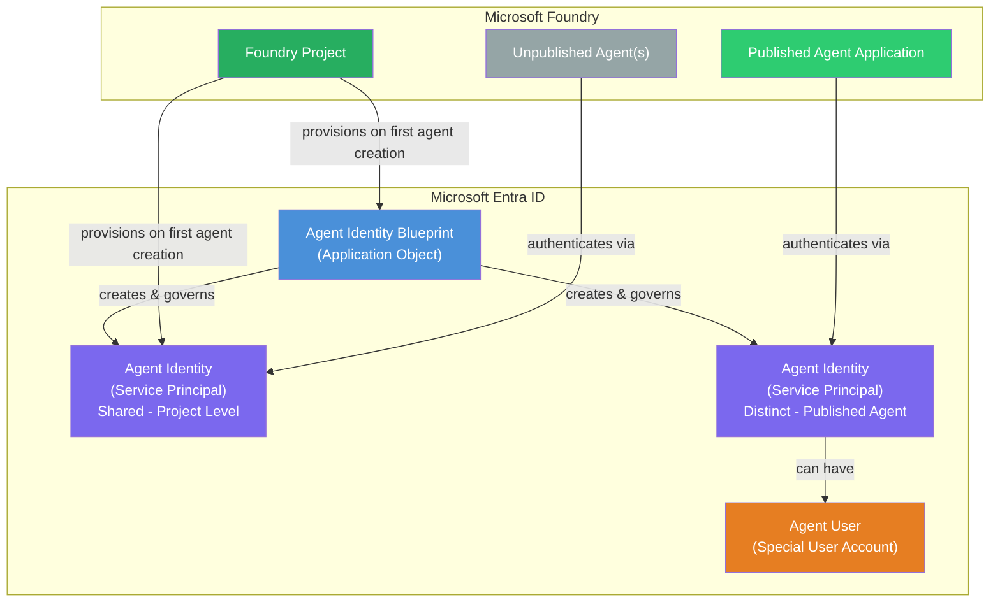

## Identity Lifecycle in Foundry

[Microsoft Foundry automatically provisions and manages agent identities](https://learn.microsoft.com/azure/ai-foundry/agents/concepts/agent-identity#foundry-integration) throughout the agent development lifecycle:

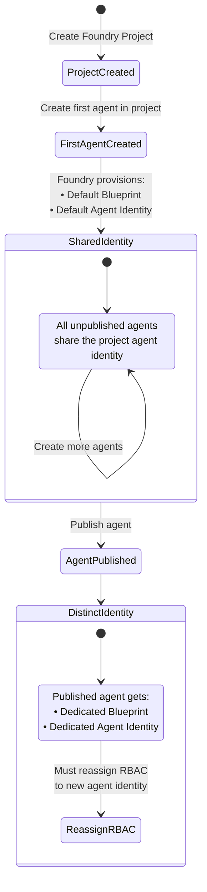

### Key Lifecycle Events

1. **Project created** — No identities exist yet.
2. **First agent created** — Foundry provisions a default [agent identity blueprint](https://learn.microsoft.com/entra/agent-id/identity-platform/create-blueprint) and a shared [agent identity](https://learn.microsoft.com/entra/agent-id/identity-platform/create-delete-agent-identities) for the project.
3. **Additional agents created** — All use the shared project identity. This simplifies permission management during development.
4. **Agent published** — Foundry creates a [dedicated agent identity blueprint and agent identity](https://learn.microsoft.com/azure/ai-foundry/agents/concepts/agent-identity#distinct-agent-identity) bound to the agent application resource. **You must reassign RBAC permissions** to the new identity.

> [!IMPORTANT]
> Publishing changes which identity is used for tool calls. Any [RBAC role assignments](https://learn.microsoft.com/azure/role-based-access-control/overview) on downstream resources must be updated to the new distinct agent identity.

## Tool Authentication Modes

Agent identities support [two key authentication scenarios](https://learn.microsoft.com/azure/ai-foundry/agents/concepts/agent-identity#authentication-capabilities):

| Mode | Name | Description | User Context Preserved |
|------|------|-------------|----------------------|
| **A** | [Agent Identity (Unattended)](https://learn.microsoft.com/azure/ai-foundry/agents/concepts/agent-identity#tool-authentication) | Agent authenticates as itself using its own service principal. RBAC roles assigned to the `agentIdentityId`. | No |
| **B** | [Delegated / On-Behalf-Of (OBO)](https://learn.microsoft.com/entra/agent-id/identity-platform/agent-on-behalf-of-oauth-flow) | Agent authenticates on behalf of the signed-in user. The downstream resource sees the user's identity. | Yes |
| **C** | [OAuth Identity Passthrough](https://learn.microsoft.com/azure/foundry/agents/how-to/mcp-authentication#oauth-identity-passthrough) | User is prompted to sign in to the MCP server directly. User's OAuth session is maintained per-user. | Yes |

## End-to-End Authentication Flows

### High-Level Architecture

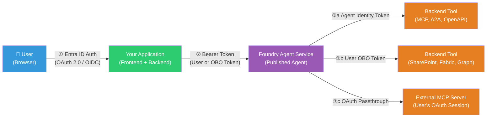

### Mode A: Agent Identity (Unattended)

The agent authenticates to downstream tools **as itself**, using the agent identity's own [service principal](https://learn.microsoft.com/entra/agent-id/identity-platform/agent-service-principals). The backend tool sees the **agent's identity**, not the user's.

**When to use:** Tools where the agent acts with its own authority — accessing a shared blob container, calling an [MCP server](https://learn.microsoft.com/azure/foundry/agents/how-to/tools/model-context-protocol), invoking another agent via [A2A](https://learn.microsoft.com/azure/foundry/agents/how-to/tools/agent-to-agent), or calling an [OpenAPI endpoint](https://learn.microsoft.com/azure/foundry/agents/how-to/tools/openapi-spec) with managed identity auth.

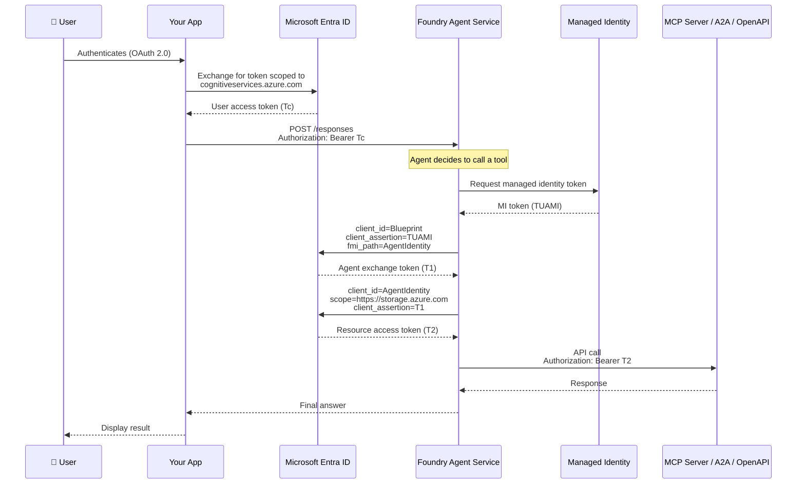

**Key points:**

- [Managed identities](https://learn.microsoft.com/entra/identity/managed-identities-azure-resources/overview) are the preferred credential type for app-only agent identity operations.
- RBAC roles must be assigned to the `agentIdentityId` on the target resource (e.g., [Storage Blob Data Contributor](https://learn.microsoft.com/azure/role-based-access-control/built-in-roles#storage-blob-data-contributor) on an Azure Storage Account).
- The user's token (Tc) is used for **authorization to the Agent Service** but the tool call itself uses the agent's own token.

### Mode B: Delegated User Identity (On-Behalf-Of)

The agent authenticates to downstream tools **on behalf of the signed-in user** using the [OAuth 2.0 OBO flow](https://learn.microsoft.com/entra/identity-platform/v2-oauth2-on-behalf-of-flow). The downstream resource sees the **user's identity** and enforces the user's permissions.

**When to use:** Tools where data access must respect per-user permissions — [SharePoint](https://learn.microsoft.com/azure/foundry/agents/how-to/tools/sharepoint) (document-level ACLs), [Microsoft Fabric](https://learn.microsoft.com/azure/foundry/agents/how-to/tools/fabric) (row-level security), [Microsoft Graph](https://learn.microsoft.com/graph/overview) (user's mailbox, calendar).

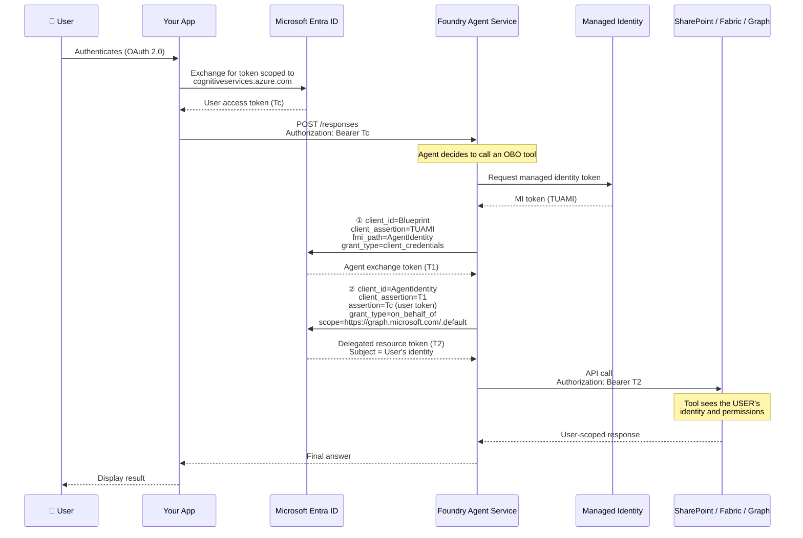

**Key points:**

- The user's access token (Tc) is used **both** for Agent Service authorization **and** as the `assertion` in the [OBO exchange](https://learn.microsoft.com/entra/agent-id/identity-platform/agent-on-behalf-of-oauth-flow).
- The OBO exchange combines the agent identity credential (T1) with the user token (Tc) to produce a delegated token (T2).
- Each end user **must have their own access** to the downstream data source, or the tool call fails.
- Consent must be configured: the agent identity needs [delegated permissions](https://learn.microsoft.com/entra/agent-id/identity-platform/interactive-agent-request-user-authorization) and users must consent to the agent accessing their data.

### Mode C: OAuth Identity Passthrough

For [MCP servers that support OAuth](https://learn.microsoft.com/azure/foundry/agents/how-to/mcp-authentication#oauth-identity-passthrough), users interacting with the agent are prompted to sign in directly to the MCP server. Their OAuth session is maintained per-user.

**When to use:** External or third-party MCP servers where users need to authenticate with their own account on the external service.

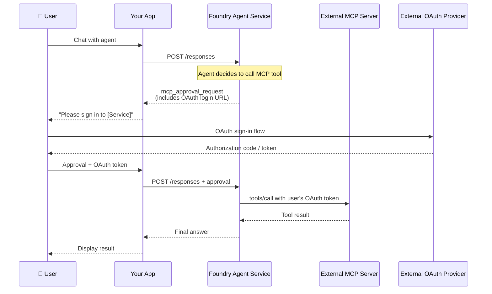

## How Your App Passes the User Token to Agent Service

The user's identity enters the Agent Service through the standard **`Authorization: Bearer <token>`** header on every SDK or REST API call. There is no special side-channel for user token passthrough.

### Token Flow from Frontend to Agent Service

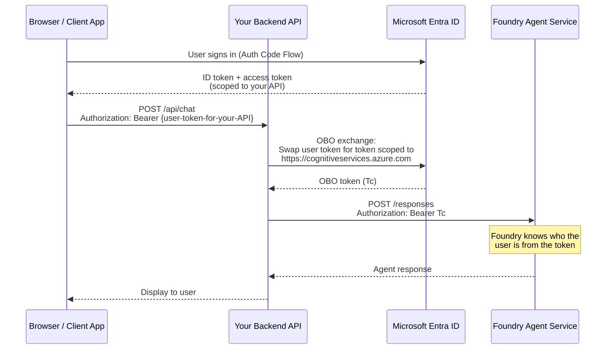

### SDK Examples

**Python** — Using the Azure AI Projects SDK:

```python
from azure.ai.projects import AIProjectClient
from azure.identity import OnBehalfOfCredential

# In your backend API handler, create an OBO credential
# using the user's incoming token
obo_credential = OnBehalfOfCredential(
    tenant_id="<tenant-id>",
    client_id="<your-backend-app-client-id>",
    client_secret="<your-backend-app-secret>",
    user_assertion=incoming_user_token,  # Token from the frontend
)

# The credential handles the OBO exchange automatically
# when the SDK requests a token for cognitiveservices.azure.com
client = AIProjectClient(
    endpoint="https://<resource>.services.ai.azure.com/api/projects/<project>",
    credential=obo_credential,
)

# Every call to the agent carries the user's delegated identity
response = client.agents.runs.create_and_process(
    thread_id=thread.id,
    assistant_id=agent.id,
)
```

**C#** — Using the Azure AI Agents SDK:

```csharp
// In your ASP.NET Core API controller, get the user's token
// and create an OBO credential
var oboCredential = new OnBehalfOfCredential(
    tenantId,
    clientId,
    clientSecret,
    userAccessToken  // Token from the incoming request
);

// The credential automatically exchanges for a token
// scoped to cognitiveservices.azure.com
var client = new PersistentAgentsClient(
    new Uri(projectEndpoint),
    oboCredential
);
```

**REST** — Direct API call:

```http
POST https://<resource>.services.ai.azure.com/api/projects/<project>/responses?api-version=2025-05-01
Authorization: Bearer <user-obo-token-scoped-to-cognitiveservices.azure.com>
Content-Type: application/json

{
    "model": "gpt-4o",
    "input": "Show me my recent SharePoint documents",
    "tools": [{ "type": "sharepoint_grounding", ... }]
}
```

> [!IMPORTANT]
> The bearer token **must** be scoped to the Foundry audience (`https://cognitiveservices.azure.com/`). If your app receives a token from the frontend scoped to your own API, your backend must perform an [OBO exchange](https://learn.microsoft.com/entra/identity-platform/v2-oauth2-on-behalf-of-flow) to get a properly-scoped token before calling the Agent Service.

### Token Handoff Summary

| Step | What Happens | Mechanism |
|------|-------------|-----------|
| User → Your App | User signs in | Standard [OAuth 2.0 Authorization Code Flow](https://learn.microsoft.com/entra/identity-platform/v2-oauth2-auth-code-flow) |
| Your App → Agent Service | Pass user identity to agent | `Authorization: Bearer <token>` — your backend does an [OBO exchange](https://learn.microsoft.com/entra/identity-platform/v2-oauth2-on-behalf-of-flow) for a token scoped to `cognitiveservices.azure.com` |
| Agent Service → Tool (Mode A) | Agent accesses resource as itself | Agent identity [obtains its own token](https://learn.microsoft.com/azure/ai-foundry/agents/concepts/agent-identity#tool-authentication) via managed identity + blueprint credentials |
| Agent Service → Tool (Mode B) | Agent accesses resource as user | Agent Service performs internal [OBO exchange](https://learn.microsoft.com/entra/agent-id/identity-platform/agent-on-behalf-of-oauth-flow): agent credential + user token → delegated resource token |

## Tool Authentication Matrix

Which identity mode applies to each tool type depends on the [tool's authentication configuration](https://learn.microsoft.com/azure/foundry/agents/how-to/mcp-authentication):

| Tool Type | Supported Auth Mode | Identity Used | User Context | Reference |
|-----------|-------------------|---------------|-------------|-----------|
| [MCP (Agent Identity)](https://learn.microsoft.com/azure/foundry/agents/how-to/mcp-authentication#use-agent-identity-authentication) | Mode A | Agent Identity | No | [MCP Authentication](https://learn.microsoft.com/azure/foundry/agents/how-to/mcp-authentication) |
| [MCP (Project MI)](https://learn.microsoft.com/azure/foundry/agents/how-to/mcp-authentication#use-project-managed-identity-authentication) | Mode A | Project Managed Identity | No | [MCP Authentication](https://learn.microsoft.com/azure/foundry/agents/how-to/mcp-authentication) |
| [MCP (OAuth Passthrough)](https://learn.microsoft.com/azure/foundry/agents/how-to/mcp-authentication#oauth-identity-passthrough) | Mode C | User's OAuth Session | Yes | [MCP Authentication](https://learn.microsoft.com/azure/foundry/agents/how-to/mcp-authentication) |
| [Agent-to-Agent (A2A)](https://learn.microsoft.com/azure/foundry/agents/how-to/tools/agent-to-agent) | Mode A | Agent Identity | No | [A2A Authentication](https://learn.microsoft.com/azure/foundry/agents/concepts/agent-to-agent-authentication) |
| [OpenAPI (Managed Identity)](https://learn.microsoft.com/azure/foundry/agents/how-to/tools/openapi-spec) | Mode A | System-assigned MI of Foundry resource | No | [Secure OpenAPI endpoints](https://learn.microsoft.com/azure/app-service/configure-authentication-ai-foundry-openapi-tool) |
| [SharePoint](https://learn.microsoft.com/azure/foundry/agents/how-to/tools/sharepoint) | Mode B | User (OBO) | Yes | [SharePoint Tool](https://learn.microsoft.com/azure/foundry/agents/how-to/tools/sharepoint) |
| [Microsoft Fabric](https://learn.microsoft.com/azure/foundry/agents/how-to/tools/fabric) | Mode B | User (OBO) | Yes | [Fabric Tool](https://learn.microsoft.com/azure/foundry/agents/how-to/tools/fabric) |
| [Microsoft 365 / Graph](https://learn.microsoft.com/graph/overview) | Mode B | User (OBO) | Yes | [Interactive Agent Tokens](https://learn.microsoft.com/entra/agent-id/identity-platform/interactive-agent-request-user-tokens) |
| [Code Interpreter](https://learn.microsoft.com/azure/foundry/agents/how-to/tools/code-interpreter) | N/A | Sandboxed execution | N/A | [Code Interpreter](https://learn.microsoft.com/azure/foundry/agents/how-to/tools/code-interpreter) |
| [File Search](https://learn.microsoft.com/azure/foundry/agents/how-to/tools/file-search) | N/A | Internal service | N/A | [File Search](https://learn.microsoft.com/azure/foundry/agents/how-to/tools/file-search) |
| [Bing Grounding](https://learn.microsoft.com/azure/foundry/agents/how-to/tools/bing-grounding) | N/A | Connection-based | N/A | [Bing Grounding](https://learn.microsoft.com/azure/foundry/agents/how-to/tools/bing-grounding) |

## Publishing and Identity Reassignment

When you [publish an agent](https://learn.microsoft.com/azure/foundry/agents/how-to/publish-agent), Foundry creates a **distinct agent identity** that replaces the shared project identity for that agent. This has critical implications for RBAC:

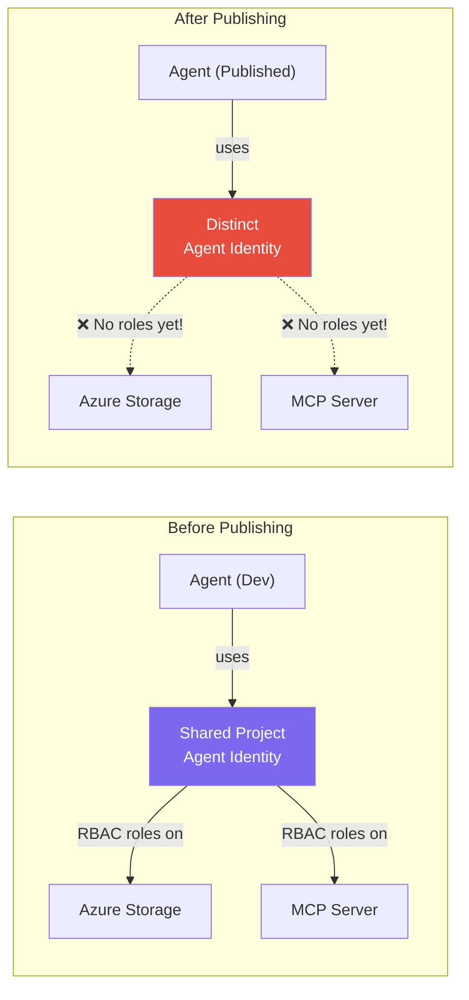

### Steps After Publishing

1. Navigate to the agent application resource in the [Azure portal](https://portal.azure.com).
2. Open **JSON View** and note the new `agentIdentityId`.
3. Assign the required [RBAC roles](https://learn.microsoft.com/azure/role-based-access-control/overview) on each downstream resource to the new `agentIdentityId`.
4. Verify the agent's tool calls succeed with the new identity.

### Finding Your Agent Identity IDs

| Scenario | Where to Find | Property |
|----------|-------------|----------|
| [Shared project identity](https://learn.microsoft.com/azure/ai-foundry/agents/concepts/agent-identity#shared-project-identity) | Foundry **Project** resource → JSON View | `agentIdentityId`, `agentIdentityBlueprintId` |
| [Distinct published identity](https://learn.microsoft.com/azure/ai-foundry/agents/concepts/agent-identity#distinct-agent-identity) | **Agent Application** resource → JSON View | `agentIdentityId`, `agentIdentityBlueprintId` |

## Security Considerations

Following [least-privilege](https://learn.microsoft.com/entra/identity-platform/secure-least-privileged-access) principles and the practices recommended in the [agent identity concepts](https://learn.microsoft.com/azure/ai-foundry/agents/concepts/agent-identity#security-considerations) documentation:

- **Narrow RBAC scope** — Assign only the permissions the agent needs. Prefer resource-level or resource-group-level scope over subscription-wide.
- **Use managed identities** — [Managed identities](https://learn.microsoft.com/entra/identity/managed-identities-azure-resources/overview) are the preferred credential for agent identity blueprints. Avoid [client secrets in production](https://learn.microsoft.com/entra/agent-id/identity-platform/create-blueprint#configure-credentials-for-the-agent-identity-blueprint).
- **Publish agents for isolation** — Treat the shared project identity as a broad blast radius. If an agent needs tighter controls or independent audit trails, publish it to get a [distinct identity](https://learn.microsoft.com/azure/ai-foundry/agents/concepts/agent-identity#distinct-agent-identity).
- **Consent management** — For [OBO (Mode B)](https://learn.microsoft.com/entra/agent-id/identity-platform/agent-on-behalf-of-oauth-flow) scenarios, ensure proper delegated permission grants and user consent.
- **Audit logging** — Agent identities appear as distinct principals in [Entra audit logs](https://learn.microsoft.com/entra/agent-id/identity-platform/agent-service-principals#audit-and-logging), enabling clear attribution of agent operations.
- **Conditional Access** — [Conditional Access policies](https://learn.microsoft.com/entra/identity/conditional-access/overview) can be applied to agent identities through the [Entra admin center](https://learn.microsoft.com/azure/ai-foundry/agents/concepts/agent-identity#manage-agent-identities).

### Agent Identity vs. Traditional Identities

Agent identities are specifically designed to address security gaps that arise when using [traditional workload identities](https://learn.microsoft.com/entra/workload-id/) for AI agents:

| Concern | Traditional Workload Identity | Agent Identity |
|---------|------------------------------|----------------|
| **Distinguishability** | Same type as all other service principals | [Distinct identity type](https://learn.microsoft.com/entra/agent-id/identity-platform/agent-service-principals) in Entra — clearly identified as an agent |
| **Lifecycle management** | Manual provisioning and deprovisioning | [Automatic lifecycle management](https://learn.microsoft.com/azure/ai-foundry/agents/concepts/agent-identity#foundry-integration) by Foundry |
| **Scale** | Each agent needs manual setup | [Blueprint model](https://learn.microsoft.com/entra/agent-id/identity-platform/create-blueprint) scales to many agent instances |
| **Critical role protection** | No agent-specific guardrails | Agent identities can be [blocked from critical security roles](https://learn.microsoft.com/entra/id-governance/agent-id-governance-overview) |
| **Governance** | Same governance as apps/services | [Purpose-built governance](https://learn.microsoft.com/entra/id-governance/agent-id-governance-overview) with access packages and sponsor/owner model |

## SDK and Code Patterns

### Pattern 1: App Calling Agent Service (Agent Identity for Tools)

Your app authenticates users and calls the Agent Service. Server-side tools use the agent's own identity.

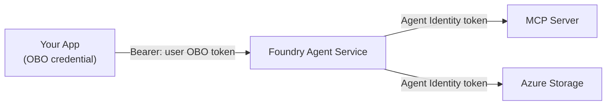

### Pattern 2: App Calling Agent Service (Delegated User Identity for Tools)

Your app authenticates users and calls the Agent Service. OBO tools use the user's delegated identity.

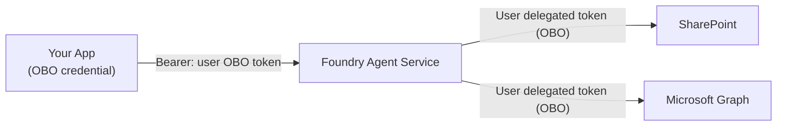

### Pattern 3: Custom Agent Web API with Agent Identity SDK

Your web API is itself an agent, using [Microsoft.Identity.Web.AgentIdentities](https://learn.microsoft.com/entra/msidweb/agent-id-sdk/agent-identities) to manage token exchanges.

```csharp
// ASP.NET Core - Interactive agent pattern (Pattern 4 from SDK docs)
// The user token arrives as a standard Authorization: Bearer header

app.MapPost("/api/agent/chat", async (HttpContext httpContext) =>
{
    string agentId = "<your-agent-identity-id>";

    var authProvider = httpContext.RequestServices
        .GetRequiredService<IAuthorizationHeaderProvider>();

    // This performs the OBO exchange:
    // incoming user token + agent identity → downstream resource token
    var options = new AuthorizationHeaderProviderOptions()
        .WithAgentIdentity(agentId);

    string authHeader = await authProvider
        .CreateAuthorizationHeaderForUserAsync(
            ["https://graph.microsoft.com/.default"],
            options);

    // Call downstream API with the user-delegated token
    // The downstream service sees the USER's identity
    // with the agent identity as an intermediary
}).RequireAuthorization();
```

### Pattern 4: Autonomous Agent (No User Context)

For background processing or batch scenarios where no user is present, using [agent user tokens](https://learn.microsoft.com/entra/agent-id/identity-platform/autonomous-agent-request-agent-user-tokens):

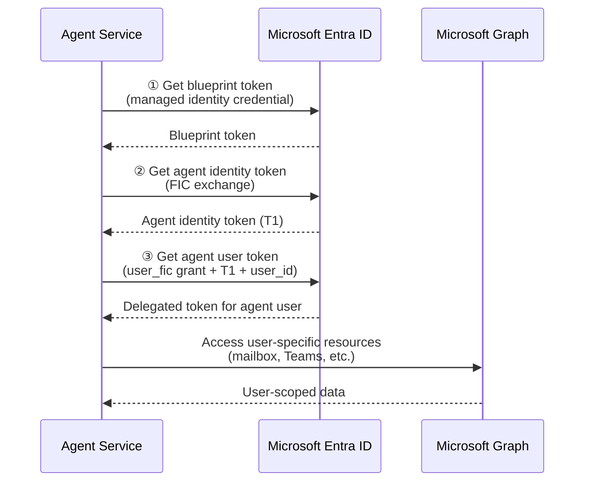

## Managing Agent Identities

### Entra Admin Center

All agent identities across your tenant can be viewed and managed in the [Microsoft Entra admin center](https://entra.microsoft.com/?Microsoft_AAD_RegisteredApps=stage1&exp.EnableAgentIDUX=true#view/Microsoft_AAD_RegisteredApps/AllAgents.MenuView/%7E/allAgentIds):

- **Conditional Access** — Apply [access policies](https://learn.microsoft.com/entra/identity/conditional-access/overview) to agent identities.
- **Identity Protection** — Monitor and protect agent identities from threats.
- **Network Access** — Control network-based access for agents.
- **Governance** — Manage [expiration, owners, and sponsors](https://learn.microsoft.com/entra/id-governance/agent-id-governance-overview) for agent identities.
- **Access Packages** — Assign access to resources via [entitlement management](https://learn.microsoft.com/entra/id-governance/agent-id-governance-overview#assigning-access-to-agent-identities).

### Programmatic Management

Agent identities can be created and managed via [Microsoft Graph APIs](https://learn.microsoft.com/entra/agent-id/identity-platform/create-delete-agent-identities):

```http
# Create an agent identity
POST https://graph.microsoft.com/beta/serviceprincipals/Microsoft.Graph.AgentIdentity
OData-Version: 4.0
Content-Type: application/json
Authorization: Bearer <token>

{
    "displayName": "My Agent Identity",
    "agentIdentityBlueprintId": "<my-agent-blueprint-id>"
}
```

```http
# Delete an agent identity
DELETE https://graph.microsoft.com/beta/serviceprincipals/<agent-identity-id>
OData-Version: 4.0
Authorization: Bearer <token>
```

Or using the [Microsoft Entra PowerShell module for agent identities](https://aka.ms/agentidpowershell) for quick testing.

## Common Issues

These issues commonly cause tool authentication failures when using agent identities:

| Issue | Resolution |
|-------|-----------|
| **Roles assigned to the wrong identity** | Confirm RBAC grants target the currently active identity. Shared project identity for [unpublished agents](https://learn.microsoft.com/azure/ai-foundry/agents/concepts/agent-identity#shared-project-identity), distinct identity for [published agents](https://learn.microsoft.com/azure/ai-foundry/agents/concepts/agent-identity#distinct-agent-identity). |
| **Missing role assignments** | Ensure the `agentIdentityId` has the required [RBAC role](https://learn.microsoft.com/azure/role-based-access-control/overview) on the target resource. |
| **Incorrect audience** | Ensure the audience matches the downstream service (e.g., `https://storage.azure.com` for Azure Storage, `https://graph.microsoft.com` for Graph). |
| **Token not scoped to cognitive services** | Your app must exchange the user token for one scoped to `https://cognitiveservices.azure.com/` before calling the Agent Service. |
| **Consent not granted for OBO** | For Mode B tools, user consent and [delegated permission grants](https://learn.microsoft.com/entra/agent-id/identity-platform/interactive-agent-request-user-authorization) must be configured on the agent identity. |
| **Fabric/SharePoint fails after Teams publish** | Agents published to Teams use project managed identity, but [Fabric](https://learn.microsoft.com/azure/foundry/agents/how-to/tools/fabric) and [SharePoint](https://learn.microsoft.com/azure/foundry/agents/how-to/tools/sharepoint) require user identity passthrough (OBO). |

## Reference Links

### Core Documentation

- [Agent Identity Concepts in Microsoft Foundry](https://learn.microsoft.com/azure/ai-foundry/agents/concepts/agent-identity)
- [What is Foundry Agent Service?](https://learn.microsoft.com/azure/foundry/agents/overview)
- [Agent Identities, Service Principals, and Applications](https://learn.microsoft.com/entra/agent-id/identity-platform/agent-service-principals)

### Authentication Flows

- [Agent OBO OAuth Flow](https://learn.microsoft.com/entra/agent-id/identity-platform/agent-on-behalf-of-oauth-flow)
- [Acquire User Tokens for Interactive Agents](https://learn.microsoft.com/entra/agent-id/identity-platform/interactive-agent-request-user-tokens)
- [Configure User Authorization for Interactive Agents](https://learn.microsoft.com/entra/agent-id/identity-platform/interactive-agent-request-user-authorization)
- [Request Agent User Tokens for Autonomous Agents](https://learn.microsoft.com/entra/agent-id/identity-platform/autonomous-agent-request-agent-user-tokens)
- [OAuth 2.0 On-Behalf-Of Flow](https://learn.microsoft.com/entra/identity-platform/v2-oauth2-on-behalf-of-flow)

### Identity Management

- [Create an Agent Identity Blueprint](https://learn.microsoft.com/entra/agent-id/identity-platform/create-blueprint)
- [Create and Delete Agent Identities](https://learn.microsoft.com/entra/agent-id/identity-platform/create-delete-agent-identities)
- [Governing Agent Identities (Preview)](https://learn.microsoft.com/entra/id-governance/agent-id-governance-overview)
- [Agent Identity SDK Patterns](https://learn.microsoft.com/entra/msidweb/agent-id-sdk/agent-identities)

### Tool Authentication

- [MCP Server Authentication](https://learn.microsoft.com/azure/foundry/agents/how-to/mcp-authentication)
- [A2A Authentication](https://learn.microsoft.com/azure/foundry/agents/concepts/agent-to-agent-authentication)
- [Secure OpenAPI Endpoints for Agent Service](https://learn.microsoft.com/azure/app-service/configure-authentication-ai-foundry-openapi-tool)
- [SharePoint Tool (OBO)](https://learn.microsoft.com/azure/foundry/agents/how-to/tools/sharepoint)
- [Fabric Tool (OBO)](https://learn.microsoft.com/azure/foundry/agents/how-to/tools/fabric)

### Publishing and RBAC

- [Publish an Agent](https://learn.microsoft.com/azure/foundry/agents/how-to/publish-agent)
- [Azure Role-Based Access Control in Foundry](https://learn.microsoft.com/azure/foundry/concepts/rbac-foundry)
- [Azure RBAC Overview](https://learn.microsoft.com/azure/role-based-access-control/overview)

### SDKs

- [Microsoft.Identity.Web.AgentIdentities (NuGet)](https://www.nuget.org/packages/Microsoft.Identity.Web.AgentIdentities)
- [Azure AI Projects SDK (Python)](https://pypi.org/project/azure-ai-projects/)
- [Azure AI Agents Persistent SDK (C#)](https://www.nuget.org/packages/Azure.AI.Agents.Persistent)
