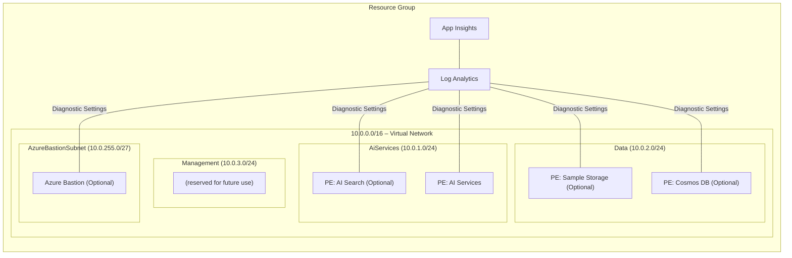

# Architecture

This document describes the Azure resources deployed by [infra/main.bicep](../infra/main.bicep), the Azure Verified Modules (AVM) used, and the network topology options.

The solution accelerator supports two primary architectural approaches:

1. **With Network Isolation**: All resources deployed with private endpoints and network isolation
2. **Without Network Isolation**: All resources deployed with public endpoints


## Core Architecture Components

### Always Deployed Resources

These resources are deployed in both architectural approaches:

| Resource | Purpose | AVM Reference |
|----------|---------|---------------|
| Microsoft Foundry (AI Services) | Core AI capabilities and project management | [avm/res/cognitive-services/account](https://github.com/Azure/bicep-registry-modules/tree/main/modules/cognitive-services/account) |
| Log Analytics Workspace | Centralized monitoring and diagnostics | [avm/res/operational-insights/workspace](https://github.com/Azure/bicep-registry-modules/tree/main/modules/operational-insights/workspace) |
| Application Insights | Application monitoring and telemetry | [avm/res/insights/component](https://github.com/Azure/bicep-registry-modules/tree/main/modules/insights/component) |

### Optional Resources

These resources are deployed based on configuration:

| Resource | When Deployed | Purpose | AVM Reference |
|----------|---------------|---------|---------------|
| Azure AI Search | `AZURE_AI_SEARCH_DEPLOY=true` | Search and indexing capabilities | [avm/res/search/search-service](https://github.com/Azure/bicep-registry-modules/tree/main/modules/search/search-service) |
| Azure Cosmos DB | `COSMOS_DB_DEPLOY=true` | Thread storage for AI agents | [avm/res/document-db/database-account](https://github.com/Azure/bicep-registry-modules/tree/main/modules/document-db/database-account) |
| Sample Data Storage | `DEPLOY_SAMPLE_DATA=true` | Dedicated storage for sample data | [avm/res/storage/storage-account](https://github.com/Azure/bicep-registry-modules/tree/main/modules/storage/storage-account) |

## Architecture with Network Isolation

When network isolation is enabled (`AZURE_NETWORK_ISOLATION=true`), all resources are deployed with private endpoints and public access is disabled.

### Network Isolation Architecture Diagram

The following diagram illustrates the architecture when network isolation is enabled:

[](images/microsoft-foundry-jumpstart-zero-trust.svg)

### Network Isolation Components

#### Core Resources (Always Deployed)

| Resource | Deployment Details | AVM Reference |
|----------|-------------------|---------------|
| Microsoft Foundry (AI Services) | Deployed with private endpoint (PE) | [avm/res/cognitive-services/account](https://github.com/Azure/bicep-registry-modules/tree/main/modules/cognitive-services/account) |
| Log Analytics Workspace | Public endpoint (monitoring services) | [avm/res/operational-insights/workspace](https://github.com/Azure/bicep-registry-modules/tree/main/modules/operational-insights/workspace) |
| Application Insights | Public endpoint (monitoring services) | [avm/res/insights/component](https://github.com/Azure/bicep-registry-modules/tree/main/modules/insights/component) |
| Virtual Network | 10.0.0.0/16 with multiple subnets | [avm/res/network/virtual-network](https://github.com/Azure/bicep-registry-modules/tree/main/modules/network/virtual-network) |
| Private DNS Zones | AI Services, OpenAI, and AI domains | [avm/res/network/private-dns-zone](https://github.com/Azure/bicep-registry-modules/tree/main/modules/network/private-dns-zone) |

#### Optional Resources (Based on Configuration)

| Resource | Condition | Deployment Details | AVM Reference |
|----------|-----------|-------------------|---------------|
| Azure AI Search | `AZURE_AI_SEARCH_DEPLOY=true` | Deployed with private endpoint (PE) | [avm/res/search/search-service](https://github.com/Azure/bicep-registry-modules/tree/main/modules/search/search-service) |
| Azure Cosmos DB | `COSMOS_DB_DEPLOY=true` | Deployed with private endpoint (PE) | [avm/res/document-db/database-account](https://github.com/Azure/bicep-registry-modules/tree/main/modules/document-db/database-account) |
| Sample Data Storage | `DEPLOY_SAMPLE_DATA=true` | Deployed with private endpoint (PE) | [avm/res/storage/storage-account](https://github.com/Azure/bicep-registry-modules/tree/main/modules/storage/storage-account) |
| Azure Bastion Host | `AZURE_BASTION_HOST_DEPLOY=true` | Required for private endpoint access | [avm/res/network/bastion-host](https://github.com/Azure/bicep-registry-modules/tree/main/modules/network/bastion-host) |

> **PE** – deployed with a private endpoint; public network access disabled where supported.

## Architecture without Network Isolation

When network isolation is disabled (`AZURE_NETWORK_ISOLATION=false`), all resources are deployed with public endpoints and no networking resources are created.

### Public Access Architecture Diagram

The following diagram illustrates the architecture when network isolation is disabled:

[](images/microsoft-foundry-jumpstart-public.svg)

### Public Access Components

#### Core Resources (Public Endpoints)

| Resource | Deployment Details | AVM Reference |
|----------|-------------------|---------------|
| Microsoft Foundry (AI Services) | Public endpoint enabled | [avm/res/cognitive-services/account](https://github.com/Azure/bicep-registry-modules/tree/main/modules/cognitive-services/account) |
| Log Analytics Workspace | Public endpoint (monitoring services) | [avm/res/operational-insights/workspace](https://github.com/Azure/bicep-registry-modules/tree/main/modules/operational-insights/workspace) |
| Application Insights | Public endpoint (monitoring services) | [avm/res/insights/component](https://github.com/Azure/bicep-registry-modules/tree/main/modules/insights/component) |

#### Optional Resources (Public Configuration)

| Resource | Condition | Deployment Details | AVM Reference |
|----------|-----------|-------------------|---------------|
| Azure AI Search | `AZURE_AI_SEARCH_DEPLOY=true` | Public endpoint enabled | [avm/res/search/search-service](https://github.com/Azure/bicep-registry-modules/tree/main/modules/search/search-service) |
| Azure Cosmos DB | `COSMOS_DB_DEPLOY=true` | Public endpoint enabled | [avm/res/document-db/database-account](https://github.com/Azure/bicep-registry-modules/tree/main/modules/document-db/database-account) |
| Sample Data Storage | `DEPLOY_SAMPLE_DATA=true` | Public endpoint enabled | [avm/res/storage/storage-account](https://github.com/Azure/bicep-registry-modules/tree/main/modules/storage/storage-account) |

## Network Topology (Network Isolation Mode)

When network isolation is enabled (`AZURE_NETWORK_ISOLATION=true`), all resources are deployed within a virtual network with private endpoints.

### Virtual Network Subnets

The virtual network is segmented into multiple subnets to enable granular network security and future scalability:

| Subnet              | Address‑Prefix    | Purpose                                                    |
|---------------------|------------------|-------------------------------------------------------------|
| `Default`           | 10.0.0.0/24      | Reserved for future use (not used)                          |
| `AiServices`        | 10.0.1.0/24      | AI Search & AI Services private endpoints   |
| `Data`              | 10.0.2.0/24      | Sample Data Storage and Cosmos DB private endpoints         |
| `Management`        | 10.0.3.0/24      | Reserved for future management endpoints (currently unused) |
| `AzureBastionSubnet`| 10.0.255.0/27    | Bastion gateway (optional)                                  |


All private endpoints are placed in their dedicated subnets, isolating traffic and enabling granular NSG rules if required.

### Logical Network Topology

The following diagram illustrates the logical network topology of the deployed resources. The `azd-env-name` tag is applied to all resources for traceability.



> **Note:** The `Management` subnet is currently empty and reserved for future use (e.g., private endpoints for monitoring or management).

## Configuration Examples

### Minimal Deployment (Public Endpoints)

```bash
azd env set MICROSOFT_FOUNDRY_PROJECT_DEPLOY true
azd env set AZURE_NETWORK_ISOLATION false
```

**Result**: AI Services with projects, public endpoints.

### Full Deployment with Network Isolation

```bash
azd env set MICROSOFT_FOUNDRY_PROJECT_DEPLOY true
azd env set AZURE_AI_SEARCH_DEPLOY true
azd env set COSMOS_DB_DEPLOY true
azd env set DEPLOY_SAMPLE_DATA true
azd env set AZURE_NETWORK_ISOLATION true
azd env set AZURE_BASTION_HOST_DEPLOY true
```

**Result**: AI Services + AI Search + Cosmos DB + Sample Data, private endpoints, Bastion access.

### Full Deployment with Capability Hosts (AI Agents)

```bash
azd env set MICROSOFT_FOUNDRY_PROJECT_DEPLOY true
azd env set AZURE_AI_SEARCH_DEPLOY true
azd env set AZURE_AI_SEARCH_CAPABILITY_HOST true
azd env set COSMOS_DB_DEPLOY true
azd env set COSMOS_DB_CAPABILITY_HOST true
azd env set DEPLOY_SAMPLE_DATA true
azd env set AZURE_STORAGE_ACCOUNT_CAPABILITY_HOST true
azd env set AZURE_NETWORK_ISOLATION true
azd env set AZURE_BASTION_HOST_DEPLOY true
```

**Result**: AI Services + AI Search + Cosmos DB + Sample Data with capability hosts configured for AI agents, private endpoints, Bastion access.

## Security & Best Practices

1. **Managed Identities** – API key authentication can be disabled. All resources use managed identities to authenticate to other Azure services.
2. **Centralized Logging** – Diagnostic settings forward metrics/logs to Log Analytics.
3. **Tagging** – Every resource inherits the `azd-env-name` tag for traceability.
4. **Azure Verified Modules** – All resources are deployed using [Azure Verified Modules (AVM)](https://aka.ms/avm).
5. **Network Isolation** – When enabled, all PaaS services use private endpoints and disable public access.
6. **Zero Trust** – Network isolation deployment follows Microsoft's Zero Trust security model and Secure Future Initiative.

## Capability Hosts (AI Agents)

[Capability Hosts](https://learn.microsoft.com/azure/ai-foundry/agents/concepts/capability-hosts) enable AI agent functionality in Microsoft Foundry projects. When configured, capability hosts provide:

- **Thread Storage** – Cosmos DB stores agent conversation threads
- **Vector Stores** – AI Search provides vector search for agent knowledge bases
- **File Storage** – Storage Account stores agent files and attachments

To enable capability hosts, deploy the required resources and set the corresponding capability host parameters:

| Capability | Resource Required | Capability Host Parameter |
|------------|-------------------|---------------------------|
| Thread Storage | Cosmos DB (`COSMOS_DB_DEPLOY=true`) | `COSMOS_DB_CAPABILITY_HOST=true` |
| Vector Stores | AI Search (`AZURE_AI_SEARCH_DEPLOY=true`) | `AZURE_AI_SEARCH_CAPABILITY_HOST=true` |
| File Storage | Storage Account (`DEPLOY_SAMPLE_DATA=true`) | `AZURE_STORAGE_ACCOUNT_CAPABILITY_HOST=true` |

