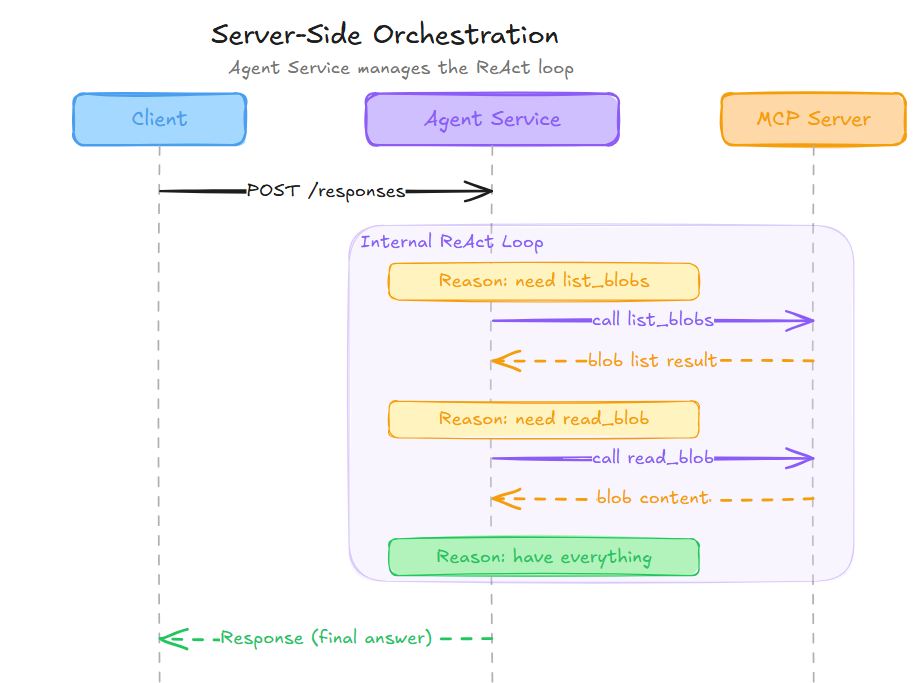
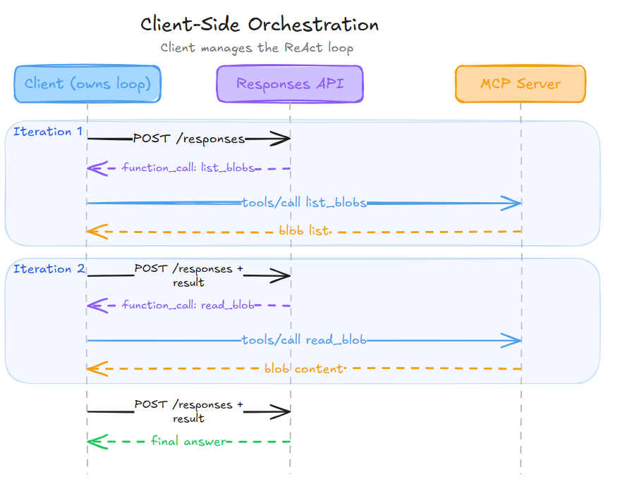
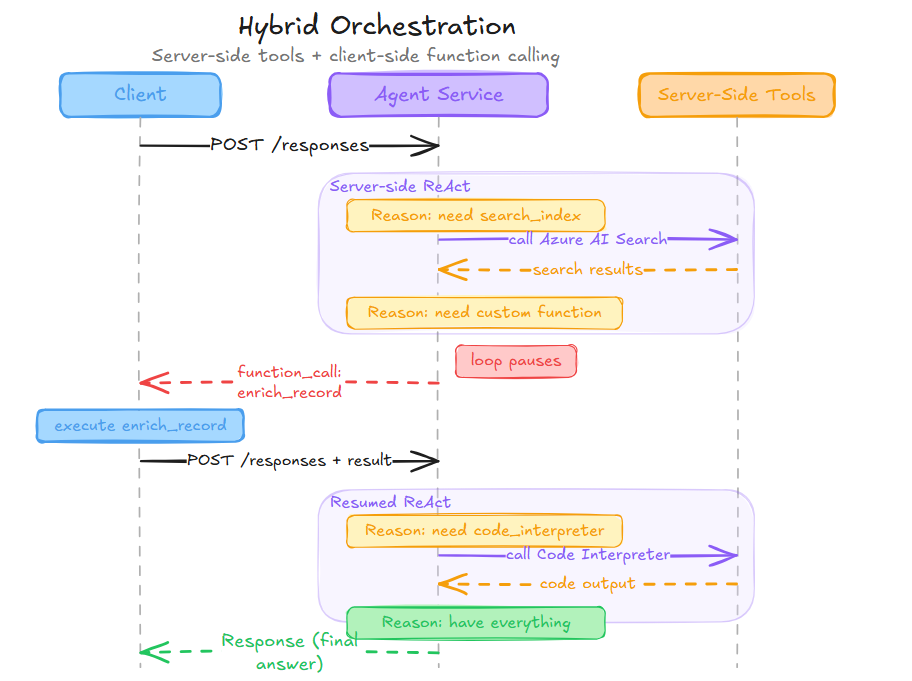

# Responses API: Server-Side (Agent Service) vs Client-Side Tool Calling

This document compares and contrasts two approaches to tool calling using the Responses API with the Microsoft Foundry Agent Service: **server-side orchestration** (Agent Service manages the tool loop) and **client-side orchestration** (client manages the tool loop). Both use the same [`POST /responses`](https://learn.microsoft.com/azure/ai-foundry/openai/reference-preview-latest?view=foundry-classic#create-response) endpoint and [`previous_response_id` chaining](https://learn.microsoft.com/azure/ai-foundry/openai/reference-preview-latest?view=foundry-classic#create-response), but differ fundamentally in where the Reason-Act-Observe (ReAct) loop executes.

> [!NOTE]
> This is a discussion document used to clarify the differences between these approaches. It is not to be used in place of the official documentation for the Responses API or the Microsoft Foundry Agent Service. It only applies to Microsoft Foundry Agent Service v2.
> The term client-side orchestration generally referrs to the backend service that calls the Responses API, not your frontend code. The key distinction is whether the ReAct loop runs inside the Agent Service (server-side) or in your own code (client-side).

## The ReAct Agent Loop

Both approaches implement the same **Reason-Act-Observe** loop. The difference is _where_ the loop runs.

### Server-Side (Agent Service Orchestration)



The **entire ReAct loop is encapsulated** in a single request. The LLM reasons, acts (tool call), observes (tool result), and loops — all server-side. The client sees only the final output. The number of internal iterations is bounded by the agent's configuration and the model's reasoning, but is **opaque to the client**.

### Client-Side (Client Orchestration)



The client **explicitly implements the ReAct loop**: it receives a tool call, executes it, feeds the result back, and repeats until the response contains no more tool calls. Each Reason step is a `POST /responses`, each Act step is a client-executed tool call.

## Comparison Matrix

| Dimension | Server-Side (Agent Service with Responses API) | Client-Side (Responses API) |
|-----------|---------------------------|----------------------------|
| **ReAct loop location** | Server-internal | Client-managed |
| **Network round-trips** | 1 (or 2 with MCP approval) | 2N+1 where N = tool calls |
| **Latency** | Lower — internal calls avoid network hops | Higher — every step crosses the network |
| **Client complexity** | Minimal — fire and forget | Significant — loop, error handling, retry (fully abstracted when using [Microsoft Agent Framework](https://learn.microsoft.com/agent-framework/overview/), which handles both scenarios equally) |
| **Tool execution** | Agent Service calls MCP servers directly | Client calls MCP servers directly |
| **Authentication for tools** | [Agent identity](https://learn.microsoft.com/entra/agent-id/identity-platform/agent-service-principals) (Entra service principal) | Client's own credentials/tokens |
| **Credential exposure** | MCP credentials stay server-side | Client must hold MCP credentials |
| **Observability** | Rich — App Insights integration (see below) | Real-time client visibility of each step |
| **Human-in-the-loop** | Via [`mcp_approval_request`](https://learn.microsoft.com/azure/foundry/agents/how-to/tools/model-context-protocol#set-up-the-mcp-connection) pattern | Full control at every step |
| **Intermediate results** | Visible post-hoc via tracing/output items | Fully visible in real-time during execution |
| **Error recovery** | Agent Service manages internally or fails | Client can retry, modify, or reroute |
| **Published agent support** | Native — this is how [Agent Applications](https://learn.microsoft.com/azure/foundry/agents/how-to/publish-agent) work | Works with stateless Responses API |
| **Conversation state** | [`previous_response_id`](https://learn.microsoft.com/azure/ai-foundry/openai/reference-preview-latest?view=foundry-classic#create-response) chaining | Same [`previous_response_id`](https://learn.microsoft.com/azure/ai-foundry/openai/reference-preview-latest?view=foundry-classic#create-response) chaining |
| **Context window truncation** | Controlled via [`truncation`](https://learn.microsoft.com/azure/foundry/openai/how-to/responses) parameter on the request | Same [`truncation`](https://learn.microsoft.com/azure/foundry/openai/how-to/responses) parameter available |
| **Context compaction** | Available via [`POST /responses/compact`](https://learn.microsoft.com/azure/foundry/openai/how-to/responses#compact-a-response) | Same [`compact`](https://learn.microsoft.com/azure/foundry/openai/how-to/responses#compact-a-response) endpoint available |
| **Hybrid orchestration** | Yes — server-side tools + [function calling](https://learn.microsoft.com/azure/foundry/agents/how-to/tools/function-calling) in a single agent | N/A — client owns all tool execution |

## Hybrid Orchestration: Mixing Server-Side and Client-Side Tool Execution

Server-side and client-side tool execution are **not mutually exclusive**. A single Foundry agent can be configured with both server-side tools (executed internally by the Agent Service) and [function calling](https://learn.microsoft.com/azure/foundry/agents/how-to/tools/function-calling) tools (returned to the client for execution) — creating a hybrid orchestration pattern within one agent run.

### Tool execution categories

The Agent Service classifies tools by where they execute:

| Execution | Tool Types |
|-----------|------------|
| **Server-side** (Agent Service executes internally) | [MCP](https://learn.microsoft.com/azure/foundry/agents/how-to/tools/model-context-protocol), [Code Interpreter](https://learn.microsoft.com/azure/foundry/agents/how-to/tools/code-interpreter), [File Search](https://learn.microsoft.com/azure/foundry/agents/how-to/tools/file-search), [Azure AI Search](https://learn.microsoft.com/azure/foundry/agents/how-to/tools/azure-ai-search), [Bing Grounding](https://learn.microsoft.com/azure/foundry/agents/how-to/tools/bing-grounding), [OpenAPI](https://learn.microsoft.com/azure/foundry/agents/how-to/tools/openapi-spec), SharePoint, Fabric, Browser Automation, Image Generation |
| **Client-side** (returned as `function_call`) | [Function calling](https://learn.microsoft.com/azure/foundry/agents/how-to/tools/function-calling) — custom functions defined by your application |

An agent can have **any combination** of these registered simultaneously. See the [tool support matrix](https://learn.microsoft.com/azure/foundry/agents/concepts/tool-best-practice) for region and model availability.

### Hybrid flow

When an agent has both server-side and function calling tools, a single run interleaves both execution modes:



The Agent Service executes server-side tools internally within the ReAct loop but **pauses and returns control to the client** whenever the model requests a function call. The client executes the function, submits `function_call_output` via `POST /responses` with `previous_response_id`, and the Agent Service resumes — potentially calling more server-side tools before returning the final answer.

### MCP approval requests: another hybrid variant

The [`mcp_approval_request`](https://learn.microsoft.com/azure/foundry/agents/how-to/tools/model-context-protocol#set-up-the-mcp-connection) pattern is a second form of hybrid flow. MCP tools execute server-side, but when an approval-required tool is invoked, the Agent Service pauses to return an approval request to the client. The client reviews the tool name and arguments, approves or rejects, and control returns to the server. This combines server-side credential isolation with client-side human oversight.

### When to use hybrid orchestration

- **Extend server-side agents with custom logic**: Register MCP/search/file tools for server-side execution and add function calling for business logic that only your application can perform (e.g., writing to a local database, calling a proprietary API not exposed via MCP).
- **Approval gates on sensitive actions**: Use `mcp_approval_request` for high-risk MCP tool calls to get human review without moving the entire tool execution client-side.
- **Progressive migration**: Start with full server-side orchestration. Add function calling tools incrementally as custom requirements emerge, without refactoring existing server-side tool configurations.

> **Tip**: Use [`tool_choice`](https://learn.microsoft.com/azure/foundry/agents/concepts/tool-best-practice) and clear agent instructions to control which tools the model prefers. For example: _"Use Azure AI Search for internal documents. Use the `enrich_record` function only when the search results need enrichment from the CRM system."_

> **References**:
>
> - [Function calling with Foundry agents](https://learn.microsoft.com/azure/foundry/agents/how-to/tools/function-calling)
> - [Tool best practices](https://learn.microsoft.com/azure/foundry/agents/concepts/tool-best-practice)
> - [MCP tool approval](https://learn.microsoft.com/azure/foundry/agents/how-to/tools/model-context-protocol#set-up-the-mcp-connection)
> - [Foundry tool catalog](https://learn.microsoft.com/azure/foundry/agents/concepts/tool-catalog)

## Security

### Server-side is significantly more secure

- **Credential isolation**: MCP server credentials (API keys, OAuth tokens, agent identity tokens) never leave the Agent Service. They're stored in [project connections](https://learn.microsoft.com/azure/foundry/agents/how-to/mcp-authentication) and used server-side. The client never sees them.
- **[Agent identity tokens](https://learn.microsoft.com/entra/agent-id/identity-platform/agent-service-principals)**: The Agent Service requests Microsoft Entra tokens scoped to the configured `audience` (e.g., `https://storage.azure.com`) using the agent's service principal. The client doesn't need (and shouldn't have) access to the downstream resources.
- **Blast radius**: If a client is compromised, it can only call `POST /responses`. It cannot directly access MCP servers or downstream Azure resources.
- **Least privilege**: The client only needs the [`Azure AI User` RBAC role](https://learn.microsoft.com/azure/foundry/concepts/rbac-foundry) on the [Agent Application](https://learn.microsoft.com/azure/foundry/agents/how-to/publish-agent). The agent identity separately holds roles for downstream resources.

### Client-side has a larger attack surface

- The client must **hold credentials** for every MCP server the agent might call (API keys, OAuth tokens, etc.).
- If the client is a browser-based app, those credentials are **exposed to the end user**.
- The client must **validate tool call arguments** before execution — a malicious or confused LLM could craft tool calls that exfiltrate data or modify resources. With server-side execution, the Agent Service is the trust boundary.
- **Tool schema injection**: In client-side mode, the tool definitions are sent with every request. A compromised client could modify tool schemas to influence LLM behavior.

### One security advantage of client-side

The client has full visibility into what the LLM wants to do _before_ it happens. This enables fine-grained **human-in-the-loop** approval without relying on the `mcp_approval_request` mechanism. You can inspect exact arguments, redact sensitive data, or refuse specific calls.

> [!IMPORTANT]
> Regardless of server vs client execution, you should always implement robust input validation, authorization, and monitoring to detect and mitigate malicious tool calls and prompt injections inside the API or MCP tool being called.

## Performance

### Server-side wins on latency

- For N tool calls: **1 network round-trip** vs **2N+1 round-trips**.
- In the two-tool blob example: **1 hop** vs **5 hops**.
- Internal tool calls within the Agent Service benefit from **Azure backbone networking** (low-latency connections between Azure services).
- No serialization/deserialization overhead for intermediate tool results crossing the network.

### Client-side can be faster in specific cases

- **Parallel tool calls**: If the LLM requests multiple independent tool calls simultaneously, the client can execute them in parallel. The Agent Service also does this, but the client has the option to use its own parallelism strategy.
- **Short-circuiting**: The client can decide mid-loop that a tool result is sufficient and skip remaining calls, constructing a synthetic response without another LLM call.
- **Caching**: The client can cache tool results across conversations and return cached results without hitting the MCP server.

### Token cost is roughly equivalent

Both approaches send the same tool results to the LLM for the same number of reasoning steps. The Responses API provides the same [`truncation`](https://learn.microsoft.com/azure/foundry/openai/how-to/responses) parameter and [`compact`](https://learn.microsoft.com/azure/foundry/openai/how-to/responses#compact-a-response) endpoint to both server-side and client-side callers, so context window management capabilities are equivalent (see [Context Window Management](#context-window-management) below).

## Context Window Management

The Responses API provides built-in mechanisms to control the context window sent to the model. These features are available to **both** server-side (Agent Service) and client-side callers — they are properties of the Responses API itself, not of the orchestration mode.

### Truncation

The [`truncation`](https://learn.microsoft.com/en-us/azure/foundry/openai/latest#create-response) parameter on `POST /responses` controls what happens when the accumulated conversation exceeds the model's context window:

- **`auto`**: The API automatically drops items from the **beginning** of the conversation to fit within the model's context window. The model continues to receive the most recent context.
- **`disabled`** (default): The request fails with a `400` error if the input exceeds the context window. This forces the caller to manage context explicitly.

With server-side Agent Service, the `truncation` setting applies to each internal LLM call within the ReAct loop. With client-side orchestration, it applies to each explicit `POST /responses` call.

### Compaction

The [`POST /responses/compact`](https://learn.microsoft.com/azure/foundry/openai/how-to/responses#compact-a-response) endpoint shrinks the context window while preserving essential information for the model's understanding. It can be used in two ways:

- **Compact using items returned**: Pass all items from previous responses (reasoning, messages, function calls, etc.) and receive a compacted version suitable as input to the next request.
- **Compact using `previous_response_id`**: Pass a response ID and receive compacted output that can be used in follow-up requests.

Compaction is particularly useful for long multi-turn conversations where the accumulated context approaches the model's token limit. Unlike truncation (which simply drops old items), compaction summarizes and preserves the semantic content of earlier conversation turns.

> **Note**: Neither truncation nor compaction is exclusive to server-side or client-side orchestration. Both are Responses API features that can be used regardless of where the ReAct loop runs. The [Chat Completions API](https://learn.microsoft.com/azure/foundry/openai/how-to/chatgpt#manage-conversations) does **not** offer these features — with Chat Completions, context window management is entirely the caller's responsibility.

> **References**:
>
> - [Use the Azure OpenAI Responses API — Compact a Response](https://learn.microsoft.com/azure/foundry/openai/how-to/responses#compact-a-response)
> - [Manage conversations with Chat Completions](https://learn.microsoft.com/azure/foundry/openai/how-to/chatgpt#manage-conversations)

## Observability and Debugging

### Server-side: Rich platform observability via Application Insights

Server-side tool calling through the Agent Service provides **comprehensive observability** capabilities through deep integration with Azure Monitor and Application Insights:

- **[Agent Monitoring Dashboard](https://learn.microsoft.com/azure/foundry/observability/how-to/how-to-monitor-agents-dashboard)**: The Foundry portal provides a built-in **Monitor** tab for each agent that displays real-time dashboards tracking token usage, latency, run success rates, evaluation scores, and red teaming results. This dashboard reads telemetry directly from the Application Insights resource connected to your Foundry project.
- **Distributed tracing**: Built on [OpenTelemetry Generative AI Semantic Conventions](https://opentelemetry.io/docs/specs/semconv/gen-ai/), the Agent Service emits traces that capture the full execution flow — LLM calls, tool invocations, agent decisions, and inter-service dependencies. Each agent run produces a trace you can inspect in the Foundry portal's **Tracing** view or in Application Insights' **End-to-end transaction details** view.
- **[End-to-end transaction details (simple view)](https://learn.microsoft.com/azure/azure-monitor/app/agents-view)**: Application Insights provides an **Agent details** view (under **Agents (Preview)** in the portal) that shows agent steps in a clear, story-like format — including the invoked agent, underlying LLM, executed tools, and intermediate results. You can drill into individual tool calls or model invocations directly.
- **Search and filtering**: Sort traces by metrics like "most tokens used" to identify expensive operations, filter by time range to isolate incidents, and search through prompt content (if sensitive data logging is enabled via [`AZURE_TRACING_GEN_AI_CONTENT_RECORDING_ENABLED`](https://learn.microsoft.com/azure/foundry-classic/how-to/develop/trace-agents-sdk#instrument-tracing-in-your-code)).
- **[Continuous evaluation](https://learn.microsoft.com/azure/foundry/observability/how-to/how-to-monitor-agents-dashboard#set-up-continuous-evaluation-python-sdk)**: Set up automated evaluation rules that run on sampled agent responses in production. Built-in evaluators measure quality (coherence, fluency), RAG-specific metrics (groundedness, relevance), safety (hate/violence detection), and agent-specific metrics (tool call accuracy, task completion).
- **[Red team scans](https://learn.microsoft.com/azure/foundry/concepts/ai-red-teaming-agent)**: Schedule adversarial tests to detect risks such as data leakage, prompt injection, or prohibited actions.
- **[Alerting](https://learn.microsoft.com/azure/foundry/observability/how-to/how-to-monitor-agents-dashboard)**: Configure alerts for latency spikes, token usage anomalies, evaluation score drops, or red team findings.
- **[Grafana integration](https://learn.microsoft.com/azure/azure-monitor/app/agents-view)**: For advanced visualization, select "Explore in Grafana" from the Agent details view to access pre-built dashboards for Agent Framework, Agent Framework workflow, and AI Foundry metrics.
- **[User feedback correlation](https://learn.microsoft.com/azure/foundry-classic/how-to/develop/trace-agents-sdk#attach-user-feedback-to-traces)**: Attach user feedback to traces using OpenTelemetry semantic conventions and correlate feedback with specific agent runs for closed-loop quality improvement.
- **[Framework support](https://learn.microsoft.com/azure/foundry-classic/how-to/develop/trace-agents-sdk#integrations)**: Tracing works across multiple frameworks including LangChain, LangGraph, Semantic Kernel, and the OpenAI Agents SDK, all emitting standardized OpenTelemetry spans.

The key trade-off is that observability is **post-hoc by design**: you cannot pause or inspect intermediate states _during_ execution, but the telemetry captured after the fact is richer and more structured than what most custom client-side logging implementations achieve.

> **References**:
>
> - [Monitor agents with the Agent Monitoring Dashboard](https://learn.microsoft.com/azure/foundry/observability/how-to/how-to-monitor-agents-dashboard)
> - [Monitor AI agents with Application Insights](https://learn.microsoft.com/azure/azure-monitor/app/agents-view)
> - [Trace and observe AI agents in Microsoft Foundry](https://learn.microsoft.com/azure/foundry-classic/how-to/develop/trace-agents-sdk)

### Client-side: Real-time developer visibility

- Every tool call and result is visible to the client **in real-time** as it happens.
- You can log exact request/response pairs for each step using your own logging framework.
- You can set breakpoints in the client's tool execution loop during development.
- However, **you must build and maintain your own observability pipeline**. The platform-level dashboards, evaluations, trace correlation, and alerting you get for free with server-side are not available — you must instrument everything yourself (e.g., OpenTelemetry SDK, custom Application Insights integration).
- If using Microsoft Agent Framework, you can leverage its built-in telemetry features even in client-side orchestration mode, but you won't get the same out-of-the-box dashboards and continuous evaluation capabilities as server-side.

### Summary

| Observability Aspect | Server-Side (Agent Service) | Client-Side |
|---------------------|---------------------------|-------------|
| **Real-time step visibility** | No (post-hoc via traces) | Yes |
| **Platform dashboards** | Yes (Foundry Monitor tab) | No (build your own) |
| **Distributed tracing** | Built-in (OpenTelemetry + App Insights) | Must implement yourself |
| **End-to-end transaction view** | Yes (App Insights simple view) | No |
| **Continuous evaluation** | Built-in (sample & score production traffic) | Must implement yourself |
| **Red team scanning** | Built-in (scheduled adversarial tests) | Must implement yourself |
| **Alerting** | Built-in (latency, tokens, scores) | Must configure yourself |
| **Grafana dashboards** | Pre-built dashboards available | Must create yourself |
| **User feedback correlation** | Built-in via OpenTelemetry | Must implement yourself |
| **Debug breakpoints** | No | Yes |
| **Custom logging control** | Limited (use what platform provides) | Full control |

## Reliability and Error Recovery

### Server-side is simpler but less controllable

- The Agent Service handles all tool call orchestration, retries, and error handling internally. The client receives a final success or failure response.
- Non-streaming MCP tool calls have a [**100-second timeout**](https://learn.microsoft.com/azure/foundry/agents/how-to/tools/model-context-protocol#known-limitations). If the MCP server is slow, the entire response fails.
- The Agent Service has internal retry logic, but it's opaque and not configurable.
- If a tool call fails, the Agent Service decides how to handle it (retry, abort, or ask the LLM to try something else) — the client has no say.

### Client-side has more control but requires more work

- If an MCP server call fails, the client can retry with exponential backoff, try an alternative server, or return a synthetic error to the LLM.
- The client can implement circuit breakers for flaky MCP servers.
- If the LLM requests an unreasonable tool call, the client can reject it and provide a corrective message.

## Microsoft Agent Framework

[Microsoft Agent Framework](https://learn.microsoft.com/agent-framework/overview/) is an open-source SDK for building multi-agent AI applications in .NET and Python. Its core value proposition is **code portability**: the same application code works regardless of whether tools execute server-side or client-side, and regardless of which API or model provider is used. You write `agent.Run()` once and swap the backend by changing only the provider configuration.

### Unified Agent Interface

Agent Framework provides a single `AIAgent` interface that abstracts the underlying API surface. You create agents through a [provider](https://learn.microsoft.com/agent-framework/agents/providers/) — a thin wrapper around the SDK client for each backend:

```python
# Python — create via provider, run identically regardless of backend
from agent_framework.azure import AzureAIAgentProvider

provider = AzureAIAgentProvider(ai_project_client)
agent = await provider.create_agent(name="assistant", model=model, instructions="...", tools=[tool])
result = await agent.run("Summarize the blobs in this container")
print(result)
```

```csharp
// C# — create via Foundry SDK extension, run identically regardless of backend
AIAgent agent = await persistentAgentsClient.CreateAIAgentAsync(
    model, name: "assistant", instructions: "...", tools: [tool]);
var result = await agent.RunAsync("Summarize the blobs in this container");
Console.WriteLine(result);
```

The same `Run()` / `RunAsync()`, streaming, middleware, multi-turn sessions, and multi-agent orchestration APIs are available across all providers:

| Backend | Provider / Client | Tool Execution |
|---------|-------------------|----------------|
| [Foundry Agent Service](https://learn.microsoft.com/agent-framework/agents/providers/azure-openai) | `AzureAIProjectAgentProvider` / `PersistentAgentsClient` | **Server-side** — platform manages the ReAct loop, hosted MCP, code interpreter, file search, web search |
| [Responses API](https://learn.microsoft.com/agent-framework/agents/providers/azure-openai) | `AzureOpenAIResponsesClient` / `OpenAIResponsesClient` | **Client-side** — Agent Framework manages the ReAct loop locally |
| [Chat Completions API](https://learn.microsoft.com/agent-framework/agents/providers/azure-openai) | `AzureOpenAIChatClient` / `OpenAIChatClient` | **Client-side** — Agent Framework manages the ReAct loop locally |
| [Other providers](https://learn.microsoft.com/agent-framework/agents/providers/) | Anthropic, Ollama, [and more](https://learn.microsoft.com/agent-framework/agents/providers/) | Depends on provider |

### Same Code, Different Tool Execution

The key insight is that **your application code is identical** whether tools run server-side or client-side. When tools execute server-side (Foundry Agent Service), the platform handles the ReAct loop internally and Agent Framework receives the final answer. When tools execute client-side (Responses API stateless mode or Chat Completions API), Agent Framework owns the ReAct loop and handles it automatically:

1. Detects `function_call` items in the response
2. Invokes the registered tool functions with the LLM-provided arguments
3. Feeds results back to the model as `function_call_output` items
4. Loops until the model produces a final answer with no remaining tool calls

This means the **client complexity** row in the comparison matrix — "Significant — loop, error handling, retry" — is **fully handled by Agent Framework**. Application code has the same simplicity regardless of where the ReAct loop runs.

### How Agent Framework Works with Foundry Agent Service

Agent Framework is a layer **on top of** Foundry Agent Service, not an alternative to it. The [Foundry SDK](https://learn.microsoft.com/azure/ai-foundry/foundry-sdk-overview) is a thin-client SDK auto-generated from the REST API for creating, configuring, and calling agents on the service. Agent Framework adds orchestration, middleware, observability, and multi-agent workflows on top of that thin client.

When you use Agent Framework with Foundry Agent Service:

- **Agent creation** uses the Foundry SDK (`PersistentAgentsClient` / `AIProjectClient`) to provision agents server-side, with hosted tools (MCP connections, code interpreter, file search, web search) configured via project-level connections.
- **Agent execution** uses `agent.Run()` / `agent.RunAsync()` — the same call you would make with any other provider. The framework delegates to the service, which manages the full ReAct loop and tool execution. Credentials never leave the service.
- **Switching providers** requires changing only the provider setup code. The rest of your application — orchestration logic, middleware, error handling, telemetry — remains untouched.

This design means you can develop and test locally against the Chat Completions API (with client-side tool execution), then deploy in production against Foundry Agent Service (with server-side tool execution) — using the same agent code.

> **References**:
>
> - [Microsoft Agent Framework overview](https://learn.microsoft.com/agent-framework/overview/)
> - [Supported providers](https://learn.microsoft.com/agent-framework/agents/providers/)
> - [Azure OpenAI agents](https://learn.microsoft.com/agent-framework/agents/providers/azure-openai)
> - [OpenAI-compatible endpoints](https://learn.microsoft.com/agent-framework/integrations/openai-endpoints)
> - [Foundry SDK alignment spec](https://github.com/microsoft/agent-framework/blob/main/docs/specs/001-foundry-sdk-alignment.md) — details the relationship between Agent Framework and Foundry SDK
> - [Agent provider samples (.NET)](https://github.com/microsoft/agent-framework/tree/main/dotnet/samples/GettingStarted/AgentProviders/) | [Agent samples (Python)](https://github.com/microsoft/agent-framework/tree/main/python/samples/getting_started/agents/)
> - [Middleware samples (.NET)](https://github.com/microsoft/agent-framework/tree/main/dotnet/samples/GettingStarted/Agents/Agent_Step14_Middleware/) | [Middleware samples (Python)](https://github.com/microsoft/agent-framework/tree/main/python/samples/getting_started/middleware/)
> - [OpenTelemetry samples (.NET)](https://github.com/microsoft/agent-framework/tree/main/dotnet/samples/GettingStarted/AgentOpenTelemetry/) | [Observability samples (Python)](https://github.com/microsoft/agent-framework/tree/main/python/samples/getting_started/observability/)

## Summary

The **Responses API is the same protocol** in both cases — [`POST /responses`](https://learn.microsoft.com/azure/ai-foundry/openai/reference-preview-latest?view=foundry-classic#create-response), [`previous_response_id`](https://learn.microsoft.com/azure/ai-foundry/openai/reference-preview-latest?view=foundry-classic#create-response) chaining, `function_call` / `function_call_output` items. The architectural difference is whether the ReAct loop runs **inside the Agent Service** (one request, server handles everything) or **inside the client** (multiple requests, client drives the loop).

Server-side is the **default and recommended path** for published agents — it's simpler, more secure, faster, and comes with rich platform-level observability including Application Insights dashboards, distributed tracing, continuous evaluation, and automated red teaming. Client-side is the **power-user path** when you need full control over tool execution, custom error handling, or real-time human oversight of every step.
