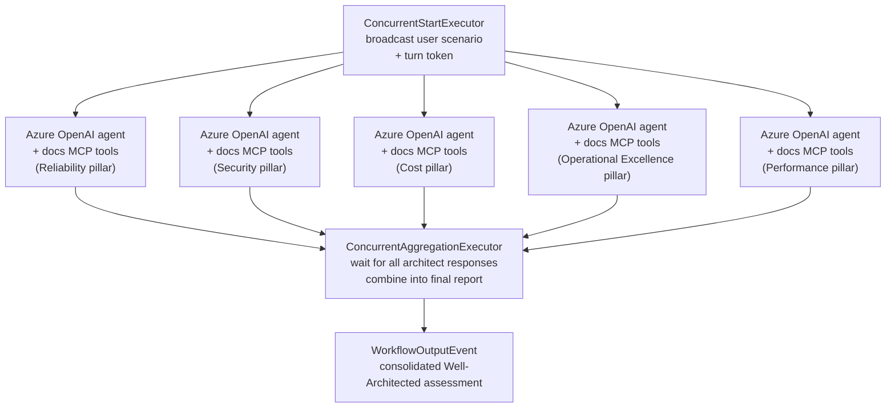

# Azure Well-Architected Concurrent Workflow Sample

This sample demonstrates how to orchestrate a concurrent Azure architecture review using the Agent Framework workflows library. A single customer scenario is broadcast to five Azure Well-Architected pillar specialists who respond in parallel and share a common Microsoft Learn docs MCP toolset. Their insights are aggregated back into a single final report for the lead architect.

## Prerequisites

- .NET SDK 9.0 or later
- An Azure OpenAI deployment that supports chat completions
- Azure CLI signed in to a tenant with access to the deployment
- Environment variables set:
  - `AZURE_OPENAI_ENDPOINT`
  - `AZURE_OPENAI_DEPLOYMENT_NAME` (defaults to `gpt-4o-mini` if omitted)

## Running the sample

```pwsh
cd dotnet/samples/AzureArchitect/AzureArchitect_Step07_Workflows
 dotnet run
```

## Key elements

- Shared Azure OpenAI client powers every pillar agent, keeping deployment details in one place.
- Microsoft Learn docs MCP tools are discovered once and cloned per agent so tool resolution is grounded and thread-safe.
- Five pillar specialists (Reliability, Security, Cost Optimization, Operational Excellence, Performance Efficiency) receive sanitized agent IDs for Azure OpenAI compatibility while still emitting friendly display names.
- A fan-out/fan-in workflow built with `WorkflowBuilder` coordinates the turn token broadcast, parallel responses, and final aggregation.
- The aggregation executor buffers partial updates, waits for each architect to emit textual output, then composes a consolidated briefing sorted by pillar.

## Workflow structure


