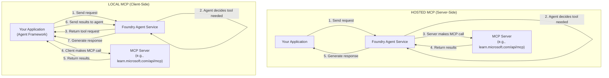
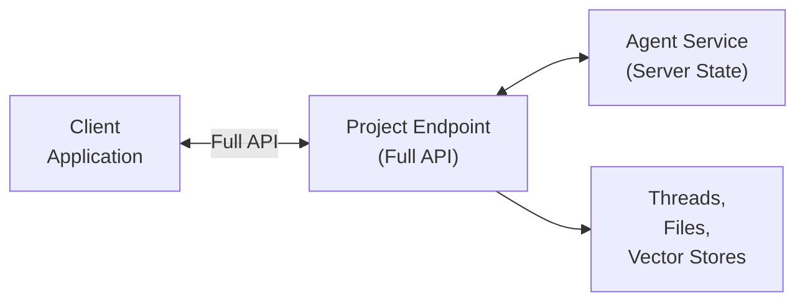
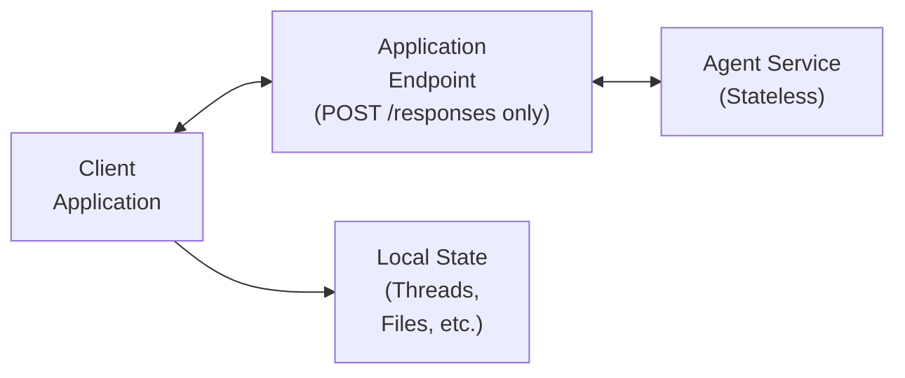
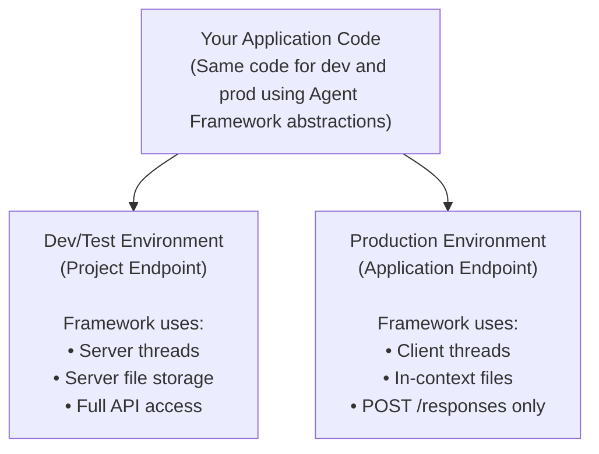
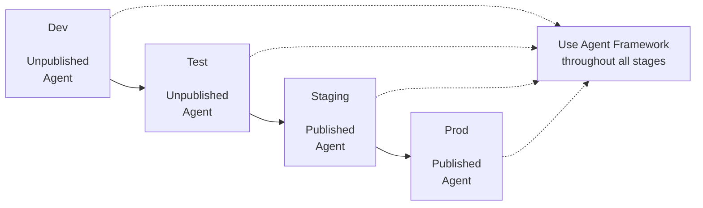
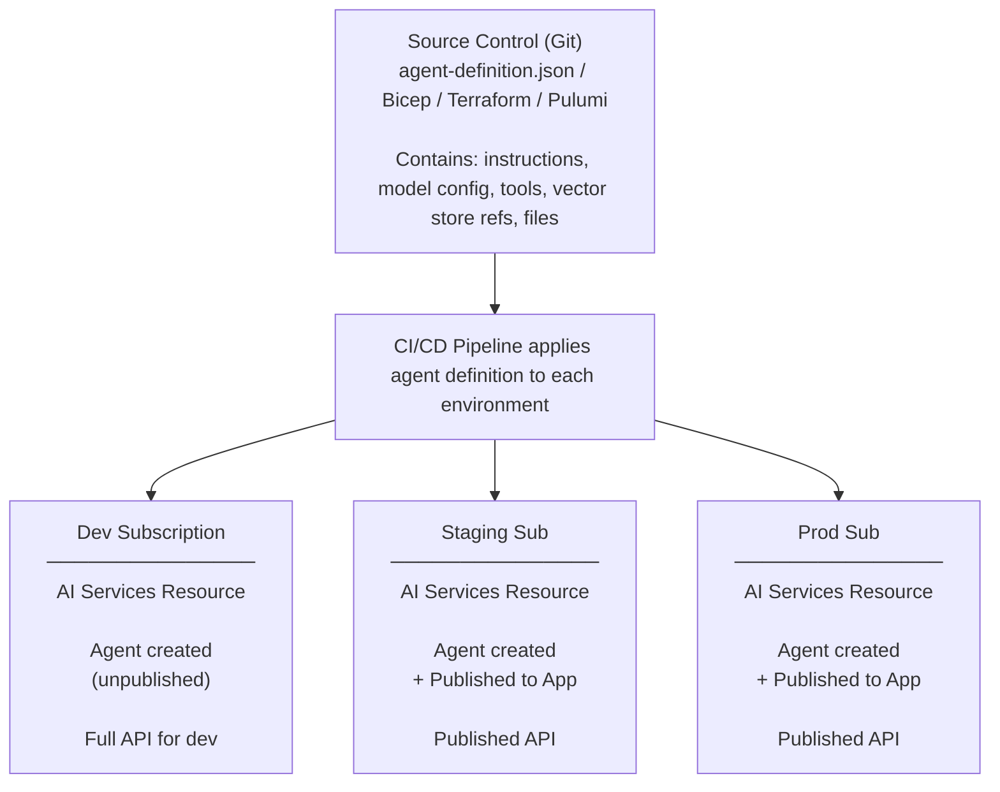

# Azure Architect Agent with Microsoft Agent Framework

> [!WARNING]
> **Preview Features - Discussion Document Only**
>
> This document discusses multiple preview features and represents exploratory approaches to using Agent Service Project Agents and Agent Applications. It is intended for discussion and exploration purposes only and **should not be used to make strategic decisions**. The patterns, workflows, and architectural guidance described here are subject to change as these preview features evolve.

This directory contains samples demonstrating an **Azure Architect Agent** using the
[Microsoft Agent Framework](https://github.com/microsoft/agent-framework) with
[Microsoft Foundry Agent Service](https://learn.microsoft.com/azure/ai-foundry/agents) for
both **development** (unpublished agents) and **production** (published agents) scenarios.

## Azure Architect Agent

The Azure Architect Agent is an AI assistant that helps users design, validate, and implement
Azure cloud solutions following the Well-Architected Framework. It combines:

### Tools

| Tool | Type | Description |
|------|------|-------------|
| **Microsoft Learn MCP** | MCP Tool | Searches Azure documentation via Model Context Protocol |
| **estimate_azure_costs** | Local Python | Generates cost estimates for Azure services |
| **validate_architecture** | Local Python | Validates designs against Well-Architected pillars |
| **generate_bicep_snippet** | Local Python | Creates infrastructure-as-code snippets |

### Capabilities

- Answer Azure architecture questions with up-to-date documentation
- Estimate costs for proposed Azure solutions
- Validate designs for security, reliability, performance, cost, and operations
- Generate Bicep templates for common Azure resources

### Example Interactions

```text
User: I need to design a web app with SQL and Redis cache

Azure Architect: I'll help you design this solution. Let me:
1. Search for best practices [calls MCP tool]
2. Validate the architecture [calls validate_architecture]
3. Estimate your costs [calls estimate_azure_costs]
4. Generate Bicep templates [calls generate_bicep_snippet]

Based on Well-Architected Framework...
```

## Overview

Microsoft Foundry Agent Service supports two modes of operation:

| Mode | Endpoint | Use Case | API Availability |
|------|----------|----------|------------------|
| **Unpublished (Development)** | Project endpoint | Development, testing, debugging | Full Responses API (threads, files, vector stores, containers) |
| **Published (Production)** | Agent Application endpoint | Production, customer-facing | Limited API (only POST /responses, no server-side state storage) |

### Key Differences

When you **publish an agent** to become an Agent Application:

1. **Stable Endpoint**: The application gets a dedicated, stable URL that doesn't change across updates
2. **User Data Isolation**: Each user's interactions are isolated (not shared like in projects)
3. **Limited API**: Only `POST /responses` is available; `/conversations`, `/files`,
   `/vector_stores`, and `/containers` are **inaccessible**
4. **Client-Side State**: Conversation history must be stored on the client side
5. **RBAC Authentication**: Callers need Azure AI User role on the Agent Application resource

### Microsoft Agent Framework Advantages

The Microsoft Agent Framework abstracts these differences, allowing you to write code that
works in **both** environments with minimal changes:

- **Threads**: Framework provides client-side thread management via `AgentThread` and
  `ChatMessageStore` that work regardless of backend support
- **Tools**: Function calling works the same in both modes
- **Files**: For published agents, file content can be passed in-context rather than uploaded
- **MCP Tools**: Model Context Protocol tools work identically in both modes (see below)

> [!WARNING]
> **Python SDK Limitation**: As of February 2025, the Python Microsoft Agent Framework SDK **does not support published Agent Applications**. The framework only works with unpublished (project) agents. For published agents, you must use direct REST API calls. See [Observed Challenges](#observed-challenges-in-microsoft-agent-framework-preview) for complete details and workaround code.
>
> **Impact**: The advantages listed above are **theoretical** for published agents until SDK support is added. Currently, only unpublished agents can use the framework's abstractions in Python.

## MCP Tool Execution: Server-Side vs Client-Side

A key capability of Microsoft Agent Framework is **MCP (Model Context Protocol)** tool support.
MCP tools work **identically** whether your agent is published or unpublished. The key
question is: **where does the MCP call execute?**

### Understanding MCP Execution Locations



### MCP Tool Types in Agent Framework

| Tool Type | Execution Location | Use Case | Approval Support |
|-----------|-------------------|----------|------------------|
| `HostedMCPTool` | **Server-side** (Foundry Agent Service) | Production with governance | Yes (`always_require`, `never_require`, `auto`) |
| `MCPStreamableHTTPTool` | **Client-side** (Agent Framework) | Development, full control | No (client controls) |

### Key Insight: Same Behavior Across Published/Unpublished

The MCP execution location is **independent** of whether your agent is published:

| Configuration | Agent State | MCP Execution |
|---------------|-------------|---------------|
| `HostedMCPTool` + Project Endpoint | Unpublished | Server-side |
| `HostedMCPTool` + Application Endpoint | Published | Server-side |
| `MCPStreamableHTTPTool` + Project Endpoint | Unpublished | Client-side |
| `MCPStreamableHTTPTool` + Application Endpoint | Published | Client-side |

**The same MCP tool configuration produces identical results regardless of publish state.**

### Code Comparison: Hosted vs Local MCP

Both samples demonstrate the Azure Architect agent with MCP (`https://learn.microsoft.com/api/mcp`)
plus local Python tools:

```python
# HOSTED MCP + Local Tools - Server makes the MCP call
from agent_framework import HostedMCPTool, FunctionTool
from common import (
    AZURE_ARCHITECT_NAME, AZURE_ARCHITECT_INSTRUCTIONS, AZURE_ARCHITECT_TOOLS,
    estimate_azure_costs, validate_architecture, generate_bicep_snippet,
)

# Create local Python tools
local_tools = [
    FunctionTool(name="estimate_azure_costs", description=AZURE_ARCHITECT_TOOLS[0]["description"], function=estimate_azure_costs),
    FunctionTool(name="validate_architecture", description=AZURE_ARCHITECT_TOOLS[1]["description"], function=validate_architecture),
    FunctionTool(name="generate_bicep_snippet", description=AZURE_ARCHITECT_TOOLS[2]["description"], function=generate_bicep_snippet),
]

# MCP tool for Microsoft Learn
mcp_tool = HostedMCPTool(
    name="Microsoft Learn MCP",
    url="https://learn.microsoft.com/api/mcp",
    approval_mode="never_require",
)

# Create agent with both tool types
agent = await provider.create_agent(
    name=AZURE_ARCHITECT_NAME,
    instructions=AZURE_ARCHITECT_INSTRUCTIONS,
    tools=[mcp_tool] + local_tools,
)

# LOCAL MCP + Local Tools - Client makes the MCP call
from agent_framework import MCPStreamableHTTPTool, FunctionTool

mcp_tool = MCPStreamableHTTPTool(
    name="Microsoft Learn MCP",
    url="https://learn.microsoft.com/api/mcp",
)

agent = await provider.create_agent(
    name=AZURE_ARCHITECT_NAME,
    instructions=AZURE_ARCHITECT_INSTRUCTIONS,
    tools=[mcp_tool] + local_tools,  # Same local_tools as above
)
```

### When to Use Each Approach

| Scenario | Recommended Approach | Reason |
|----------|---------------------|--------|
| Production with governance | `HostedMCPTool` | Approval workflows, audit logging |
| Production with sensitive MCP servers | `HostedMCPTool` | Server-side authentication, no client exposure |
| Development and debugging | `MCPStreamableHTTPTool` | Full visibility into MCP calls |
| Testing MCP integrations | `MCPStreamableHTTPTool` | Easily mock/intercept calls |
| MCP server requires client auth | `MCPStreamableHTTPTool` | Client can handle OAuth/tokens |

### Sample Commands

```bash
# Run Azure Architect with hosted MCP (server-side execution)
python unpublished_agent.py --hosted-mcp

# Run Azure Architect with local MCP (client-side execution)
python unpublished_agent.py --local-mcp

# Run Azure Architect in production mode with hosted MCP
python published_agent.py --hosted-mcp

# Run Azure Architect in production mode with local MCP
python published_agent.py --local-mcp

# Interactive mode for architecture consultation
python unpublished_agent.py --hosted-mcp --interactive

# Ask specific architecture questions
python unpublished_agent.py --hosted-mcp -q "Estimate costs for App Service + SQL Database"
```

All combinations use the same Azure Architect tools and produce consistent results.

## Samples

| Sample | Description | SDK Support |
|--------|-------------|-------------|
| [unpublished_agent.py](unpublished_agent.py) | Azure Architect in development mode (project endpoint) with MCP + local tools | ✅ **Fully Supported** |
| [published_agent.py](published_agent.py) | Azure Architect in production mode (application endpoint) with MCP + local tools | ⚠️ **Requires REST API Workaround** (see [Observed Challenges](#observed-challenges-in-microsoft-agent-framework-preview)) |
| [common.py](common.py) | Shared: Azure Architect config, tools, ClientSideThread, re-exports message stores | N/A |
| [cosmosdb_chat_message_store.py](cosmosdb_chat_message_store.py) | Cosmos DB persistent thread storage (custom implementation) | ✅ **Fully Supported** |
| [redis_chat_message_store.py](redis_chat_message_store.py) | **DEPRECATED**: Use `agent-framework-redis` package instead | ⚠️ Deprecated |

> [!IMPORTANT]
> **Published Agent Limitation**: The Python Microsoft Agent Framework SDK does not currently support published Agent Applications (production endpoints). The `published_agent.py` sample demonstrates the required REST API workaround pattern. See [Observed Challenges](#observed-challenges-in-microsoft-agent-framework-preview) for detailed explanation and tracking issues.
> **Note**: Redis support now uses the official `agent-framework-redis` package. The custom
> `redis_chat_message_store.py` file is deprecated and kept only for backward compatibility.

## Persistent Thread Storage

For production scenarios, you may want persistent thread storage that survives application
restarts. Two implementations are provided:

| Provider | Use Case | Latency | Scalability | Package |
|----------|----------|---------|-------------|----------|
| **Redis** | Low-latency, simple setup | Fastest (~1ms) | Single region / replicas | `agent-framework-redis` (official) |
| **Cosmos DB** | Global distribution, durability | Low (~5-10ms) | Multi-region, auto-failover | Custom implementation |

### Redis Thread Storage

Use the official `RedisChatMessageStore` from `agent-framework-redis` package for fast, simple persistent storage:

```python
from agent_framework_redis import RedisChatMessageStore
from agent_framework import ChatAgent

# Create agent with Redis message store factory
agent = ChatAgent(
    chat_client=chat_client,
    name="my-agent",
    instructions="You are a helpful assistant.",
    chat_message_store_factory=lambda: RedisChatMessageStore(
        redis_url="redis://localhost:6379",
        max_messages=100,  # Auto-trim to last 100 messages
    )
)

# Start a new conversation
thread = agent.get_new_thread()
response = await agent.run("What is Azure?", thread=thread)
```

**Azure Managed Redis with Azure AD:**

```python
from agent_framework_redis import RedisChatMessageStore
from redis.credentials import CredentialProvider
from azure.identity.aio import DefaultAzureCredential

agent = ChatAgent(
    chat_client=chat_client,
    name="my-agent",
    instructions="You are a helpful assistant.",
    chat_message_store_factory=lambda: RedisChatMessageStore(
        credential_provider=CredentialProvider(DefaultAzureCredential()),
        host="myredis.redis.cache.windows.net",
        max_messages=100,
    )
)
```

### Cosmos DB Thread Storage

For production scenarios, you may want persistent thread storage that survives application
restarts. The `CosmosDBChatMessageStore` provides this capability,
following the official [Third-Party Chat History Storage](https://learn.microsoft.com/en-us/agent-framework/tutorials/agents/third-party-chat-history-storage?pivots=programming-language-python) pattern from Microsoft Agent Framework.

### Why Cosmos DB for Thread Storage?

| Concern | In-Memory Threads | Cosmos DB Threads |
|---------|-------------------|-------------------|
| Persistence | Lost on app restart | Survives restarts |
| Scalability | Single instance | Globally distributed |
| Multi-instance | Not supported | Partition key isolation |
| Cost | Free | Cosmos DB pricing |
| Latency | Fastest | Low (few ms) |

### Using Cosmos DB with chat_message_store_factory (Recommended)

The recommended pattern from Microsoft Agent Framework is to use `chat_message_store_factory`
when creating the agent. This factory creates a new store instance for each thread:

```python
from common import CosmosDBChatMessageStore
from agent_framework import ChatAgent

# Create agent with Cosmos DB message store factory
agent = ChatAgent(
    chat_client=chat_client,
    name="my-agent",
    instructions="You are a helpful assistant.",
    chat_message_store_factory=lambda: CosmosDBChatMessageStore(
        connection_string=os.environ["COSMOS_DB_CONNECTION_STRING"],
        max_messages=100,  # Auto-trim to last 100 messages
    )
)

# Start a new conversation - store is automatically created
thread = agent.get_new_thread()
response = await agent.run("What is Azure?", thread=thread)

# The thread state can be serialized (includes store state)
serialized_thread = thread.serialize()

# Later: Resume the conversation from serialized state
resumed_thread = await agent.deserialize_thread(serialized_thread)
response = await agent.run("Tell me more", thread=resumed_thread)
```

### Alternative: Manual Thread Creation

You can also create threads manually with explicit store instances:

```python
from common import CosmosDBChatMessageStore
from agent_framework import AgentThread

# Create a Cosmos DB-backed message store with specific thread ID
cosmos_store = CosmosDBChatMessageStore(
    connection_string=os.environ["COSMOS_DB_CONNECTION_STRING"],
    thread_id="user-123-conversation-1",
    max_messages=100,
)

# Use with Agent Framework's AgentThread
thread = AgentThread(message_store=cosmos_store)
result = await agent.run("What is Azure?", thread=thread)

# Later: Resume the same conversation (even after app restart)
resumed_store = CosmosDBChatMessageStore(
    connection_string=os.environ["COSMOS_DB_CONNECTION_STRING"],
    thread_id="user-123-conversation-1",  # Same thread ID
)
resumed_thread = AgentThread(message_store=resumed_store)
result = await agent.run("Tell me more about that", thread=resumed_thread)
```

### Running with Cosmos DB

```bash
# Set the connection string
export COSMOS_DB_CONNECTION_STRING="AccountEndpoint=https://..."

# Run unpublished agent with Cosmos DB thread storage
python unpublished_agent.py --cosmos

# Combine with MCP options
python unpublished_agent.py --hosted-mcp --cosmos

# Run standalone Cosmos DB demo (shows persistence across "restarts")
python unpublished_agent.py --cosmos
```

### Message Store Features

Both implementations provide:

- **Protocol Compliant**: Implements `add_messages`, `list_messages`, `serialize_state`, `deserialize_state`
- **Thread Isolation**: Each conversation uses a unique key/partition
- **Auto Message Limits**: Configurable automatic trimming of old messages
- **Lazy Initialization**: Connects on first use
- **State Serialization**: Compatible with Agent Framework thread serialization

**Cosmos DB specific**:

- Auto database/container creation
- TTL support for automatic message expiration
- Global distribution capability

**Redis specific** (from `agent-framework-redis` package):

- Ultra-low latency (~1ms)
- Simple setup with Redis Lists
- Automatic key expiration via Redis TTL
- Azure AD authentication support for Azure Managed Redis

### Additional Resources

**Python Chat History Documentation:**

- [Agent Chat History and Memory](https://learn.microsoft.com/agent-framework/tutorials/agents/chat-history) - Official Microsoft Agent Framework guide
- [Multi-Turn Conversations with Azure AI Foundry](https://learn.microsoft.com/azure/ai-foundry/tutorials/agents/multi-turn) - Azure-specific guidance

**.NET ChatHistoryProvider:**

For .NET developers, use the official Cosmos DB ChatHistoryProvider:

- [Microsoft.Agents.AI.CosmosNoSql](https://github.com/microsoft/agent-framework/tree/main/dotnet/src/Microsoft.Agents.AI.CosmosNoSql) - Official .NET implementation

> **⚠️ Important Recommendation**: Always implement and test with a persistent `ChatMessageStore` (Python) or `ChatHistoryProvider` (.NET) as early as possible in your development cycle. The built-in Foundry conversation store should only be used for experimentation, as published agents require client-side storage.

## Prerequisites

- Python 3.8 or later
- Azure CLI installed and authenticated (`az login`)
- Microsoft Foundry project with an agent created
- Required Python packages (see [requirements.txt](requirements.txt))

## Environment Variables

Create a `.env` file or set these environment variables:

```bash
# For unpublished (development) agent
PROJECT_ENDPOINT=https://<your-foundry-resource>.services.ai.azure.com/api/projects/<project-name>

# For published (production) agent
AZURE_AI_APPLICATION_ENDPOINT=https://<your-foundry-resource>.services.ai.azure.com/api/projects/<project-name>/applications/<app-name>/protocols

# Model deployment name
AZURE_AI_MODEL_DEPLOYMENT_NAME=gpt-5-mini

# For Cosmos DB thread storage (optional)
COSMOS_DB_CONNECTION_STRING=AccountEndpoint=https://<account>.documents.azure.com:443/;AccountKey=...
```

## Installation

```bash
# Install Microsoft Agent Framework (preview)
pip install agent-framework --pre

# Install official Redis support (optional, for persistent threads)
pip install agent-framework-redis --pre

# Install Azure dependencies
pip install azure-identity azure-ai-projects azure-cosmos

# Or use requirements.txt
pip install -r requirements.txt
```

> **Note**: The `agent-framework-redis` package is the official Microsoft implementation
> for Redis support. It replaces the deprecated custom `redis_chat_message_store.py`.

## Running the Samples

### Unpublished Agent (Development Mode)

```bash
# Default: Show usage info and run hosted MCP demo
python unpublished_agent.py

# Hosted MCP: Server-side MCP execution with local tools
python unpublished_agent.py --hosted-mcp

# Local MCP: Client-side MCP execution with local tools
python unpublished_agent.py --local-mcp

# Cosmos DB: Persistent thread storage demo
python unpublished_agent.py --cosmos

# Combine MCP and Cosmos DB
python unpublished_agent.py --hosted-mcp --cosmos

# Interactive architecture consultation
python unpublished_agent.py --hosted-mcp --interactive

# Custom architecture question
python unpublished_agent.py --hosted-mcp -q "Validate: App Service + SQL + Redis Cache"
```

### Published Agent (Production Mode)

> [!WARNING]
> **SDK Limitation**: The commands below demonstrate the intended usage pattern, but currently **require REST API workaround code** due to lack of SDK support for published agents. The `published_agent.py` file contains the necessary workaround. See [Observed Challenges](#observed-challenges-in-microsoft-agent-framework-preview) for details.

```bash
# Default: Show usage info and run hosted MCP demo
python published_agent.py

# Hosted MCP: Server-side MCP execution with local tools
python published_agent.py --hosted-mcp

# Local MCP: Client-side MCP execution with local tools
python published_agent.py --local-mcp

# Interactive production consultation
python published_agent.py --local-mcp --interactive

# Generate Bicep for specific resource
python published_agent.py --hosted-mcp -q "Generate Bicep for a Storage Account"
```

## Architecture Notes

### Unpublished Agent Flow



### Published Agent Flow



## SDLC and DevOps Considerations

### The Environment Parity Challenge

A core DevOps principle is that **dev/test should mirror production** to catch issues early.
The Agent Service publish model creates a challenge: unpublished agents (dev/test) have
fundamentally different API capabilities than published agents (production):

| Capability | Dev/Test (Unpublished) | Production (Published) |
|------------|------------------------|------------------------|
| Thread management | Server-managed | Client-managed |
| File storage | Server `/files` API | In-context only |
| Vector stores | Dynamic creation | Pre-configured only |
| State persistence | Server handles it | Your responsibility |

**Without mitigation**, this means different code paths in dev vs production—an anti-pattern
that can lead to production-only bugs.

### How Microsoft Agent Framework Mitigates This

The framework's abstraction layer is the solution. By using framework components consistently,
your code follows the **same logical path** regardless of backend capabilities:



**Key principle**: Write to the framework's abstractions, not directly to the underlying APIs.

### Recommended SDLC Workflow



**Stage-by-stage guidance:**

1. **Development**: Use unpublished agent with project endpoint for rapid iteration.
   Full API access enables debugging threads, inspecting file uploads, examining vector stores.

2. **Testing**: Continue with unpublished agent. Write integration tests using framework
   abstractions. Tests validate your application logic, not Agent Service internals.

3. **Staging**: **Publish the agent**. This is your first environment using the application
   endpoint. Verify client-side state management works correctly. This catches any
   accidental dependencies on server-side features.

4. **Production**: Deploy the same published agent configuration. Same endpoint pattern,
   same client-side state handling as staging.

### Enterprise Multi-Resource Pattern

> ⚠️ **Important**: The simple workflow above assumes a single AI Services resource.
> Most enterprises require **separate resources per environment**, often in different
> Azure subscriptions. This changes how the "publish" concept works.

**The Reality of Publishing**:

- Publishing creates an Agent Application *within the same AI Services resource*
- There is **no native mechanism** to promote a published agent to another resource
- Publishing is **not like deploying a container image** through environments

**Implication**: Your agent definition must be recreated in each environment's AI Services
resource. The **agent definition becomes your deployable artifact**, not the published agent.



**Environment-Specific Agent Setup**:

When using Microsoft Agent Framework, implement environment-specific agent configuration through code rather than static definition files. Use configuration-driven code paths to handle differences between environments:

```python
# Example: Environment-specific agent setup
def create_agent(environment: str) -> Agent:
    """Create agent with environment-specific configuration."""
    
    # Common configuration
    base_instructions = "You are a helpful customer support agent..."
    base_tools = [lookup_order_tool, file_search_tool]
    
    # Environment-specific setup
    if environment == "production":
        # Production: Use published agent endpoint
        endpoint = os.getenv("AZURE_AI_APPLICATION_ENDPOINT")
        # Pre-configured vector stores only
        vector_store_id = os.getenv("PROD_VECTOR_STORE_ID")
    elif environment == "staging":
        # Staging: Use published agent endpoint (matches prod API surface)
        endpoint = os.getenv("STAGING_APPLICATION_ENDPOINT")
        vector_store_id = os.getenv("STAGING_VECTOR_STORE_ID")
    else:
        # Dev/Test: Use project endpoint with full API
        endpoint = os.getenv("PROJECT_ENDPOINT")
        # Can create/modify vector stores dynamically
        vector_store_id = get_or_create_vector_store(environment)
    
    return Agent(
        endpoint=endpoint,
        instructions=base_instructions,
        tools=base_tools,
        vector_store_ids=[vector_store_id] if vector_store_id else []
    )
```

This approach allows the framework to handle API differences transparently while keeping your agent logic consistent across environments.

**CI/CD Pipeline Steps**:

1. **Build**: Run tests, lint code, validate configuration
2. **Deploy to Dev**: Deploy application code pointing to Dev project endpoint (unpublished agent)
3. **Test in Dev**: Run integration tests against project endpoint with full API access
4. **Deploy to Staging**: Deploy application code pointing to Staging application endpoint (published agent)
5. **Test in Staging**: Validate against application endpoint (published API surface - matches production)
6. **Deploy to Prod**: Deploy application code pointing to Prod application endpoint (published agent)

**What Must Be Environment-Specific**:

| Component | Same Across Envs | Per-Environment |
|-----------|------------------|-----------------|
| Application code | ✅ | |
| Agent instructions (in code) | ✅ | |
| Tool definitions (in code) | ✅ | |
| Model selection | ✅ (usually) | Sometimes different for cost |
| Endpoint URL | | ✅ Configuration per environment |
| Vector store IDs | | ✅ Created per resource |
| File IDs | | ✅ Uploaded per resource |
| Connection strings | | ✅ Point to env-specific backends |
| AI Services endpoint | | ✅ Different resources |

**Vector Store and File Handling**:

Since vector stores and files are resource-scoped, your deployment process must:

1. Upload source documents to each environment's AI Services
2. Create vector stores in each environment
3. Store the resulting IDs in environment configuration (environment variables, Key Vault, etc.)
4. Application code retrieves these IDs at runtime based on environment

```python
# Example: Runtime configuration retrieval
def get_vector_store_config() -> str:
    """Get vector store ID from environment-specific configuration."""
    environment = os.getenv("ENVIRONMENT", "dev")
    
    if environment == "dev":
        # Dev can create dynamically or use a dev-specific store
        return os.getenv("DEV_VECTOR_STORE_ID", "")
    elif environment == "staging":
        return os.getenv("STAGING_VECTOR_STORE_ID")
    elif environment == "production":
        return os.getenv("PROD_VECTOR_STORE_ID")
    else:
        raise ValueError(f"Unknown environment: {environment}")
```

### Trade-offs and Limitations of This Model

This enterprise pattern works, but it's important to acknowledge the friction points:

| Concern | Traditional DevOps | Agent Service Reality |
|---------|-------------------|----------------------|
| Artifact promotion | Build once, deploy everywhere | Deploy same code, different config per environment |
| Environment drift | Identical artifacts prevent it | Configuration differences require careful management |
| Rollback | Redeploy previous artifact | Redeploy previous code version |
| Audit trail | Artifact registry has history | Source control tracks code + config changes |

**Mitigations**:

- **Use source control** for all application code and configuration
- **Separate configuration from code** using environment variables or configuration services
- **Automate deployments** to prevent manual configuration errors
- **Tag releases** in Git; correlate deployments to commits
- **Use configuration validation** to ensure required settings are present per environment
- **Store secrets in Key Vault** or similar services, not in source control

**Why Microsoft Agent Framework Helps**:

The framework provides critical value for this multi-environment approach:

1. **Same application code** runs across all environments without modification
2. **Endpoint type becomes configuration**, not different code branches
3. **Transparent API abstraction** - framework handles differences between project and application endpoints
4. **Client-side thread handling** works consistently regardless of backend publish state
5. **Consistent testing approach** - integration tests validate your code, not environment-specific implementations

The framework doesn't solve the multi-environment resource setup problem, but it ensures your
*application code* follows DevOps best practices and remains environment-agnostic through
configuration.

### Best Practices for Environment Parity

1. **Always use Agent Framework abstractions**
   - Use `ChatAgent` and `AgentThread`, not raw API calls
   - Let the framework handle thread storage differences
   - Pass files as content, don't rely on `/files` API in core logic

2. **Configure, don't code, the differences**
   - Endpoint URL is configuration, not code
   - Use environment variables: `PROJECT_ENDPOINT` vs `AZURE_AI_APPLICATION_ENDPOINT`
   - Same codebase, different `.env` files per environment

3. **Test with published agents in staging**
   - Don't wait until production to discover published agent limitations
   - Staging should match production's API surface exactly

4. **Pre-configure resources before publishing**
   - Vector stores needed in production must be created at agent definition time
   - Files referenced by the agent must be attached before publishing
   - Knowledge bases should be fully indexed before publish

5. **Design for statelessness from the start**
   - Even in dev, treat each request as potentially stateless
   - Store conversation history in your own data store
   - Don't assume server-side thread persistence

### What the Framework Handles vs What You Handle

| Concern | Framework Handles | You Handle |
|---------|-------------------|------------|
| Thread creation | ✅ Automatic | |
| Message history | ✅ `ChatMessageStore` | |
| Tool invocation | ✅ Same pattern both modes | |
| Credential flow | ✅ `AzureAIClient` | |
| Endpoint selection | | ✅ Configuration |
| Conversation persistence | | ✅ External storage |
| File content delivery | | ✅ In-context for published |
| Pre-publish resource setup | | ✅ Vector stores, files |

## Automating Agent Publication

The agent publication process can be fully automated using the Azure Control Plane REST API, Azure Resource Manager (ARM), Bicep, or Terraform.

### REST API

Publish agents using the Azure Cognitive Services REST API:

- [Publish Agents in Microsoft Foundry](https://learn.microsoft.com/azure/ai-foundry/agents/how-to/publish-agent) - Official publish guide

### Infrastructure as Code (Bicep/Terraform)

Agent Applications can be deployed as Azure resources:

**Application Resource:**

- [Microsoft.CognitiveServices/accounts/projects/applications](https://learn.microsoft.com/azure/templates/microsoft.cognitiveservices/accounts/projects/applications) - Bicep, ARM template & Terraform AzAPI reference

**Agent Deployment Resource:**

- [Microsoft.CognitiveServices/accounts/projects/applications/agentDeployments](https://learn.microsoft.com/azure/templates/microsoft.cognitiveservices/accounts/projects/applications/agentdeployments) - Bicep, ARM template & Terraform AzAPI reference

### Example Bicep Template

```bicep
resource aiServices 'Microsoft.CognitiveServices/accounts@2024-10-01' existing = {
  name: aiServicesName
}

resource project 'Microsoft.CognitiveServices/accounts/projects@2024-10-01' existing = {
  parent: aiServices
  name: projectName
}

resource application 'Microsoft.CognitiveServices/accounts/projects/applications@2024-10-01' = {
  parent: project
  name: applicationName
  properties: {
    displayName: 'Azure Architect Assistant'
    description: 'AI assistant for Azure architecture and Well-Architected Framework'
  }
}

resource agentDeployment 'Microsoft.CognitiveServices/accounts/projects/applications/agentDeployments@2024-10-01' = {
  parent: application
  name: 'default'
  properties: {
    agentName: agentName  // References the agent created in the project
  }
}
```

### CI/CD Integration

Incorporate agent publication into your deployment pipeline:

```yaml
# Example: Azure DevOps pipeline step
- task: AzureCLI@2
  displayName: 'Publish Agent Application'
  inputs:
    azureSubscription: $(serviceConnection)
    scriptType: 'bash'
    scriptLocation: 'inlineScript'
    inlineScript: |
      az deployment group create \
        --resource-group $(resourceGroup) \
        --template-file infra/agent-application.bicep \
        --parameters agentName=$(agentName) \
        --parameters applicationName=$(applicationName)
```

### Agent Identity Configuration

**Current Limitations (as of preview):**

- Agent Identity is automatically created when an agent is published
- Agent Identity naming/configuration may be customizable via the `agentDeployment` resource properties
- APIs exist to configure Agent Identity attributes (Owner, Sponsor, etc.) but documentation is limited
- Entra ID Terraform provider doesn't yet support Agent Identity resources
- Assigning an existing Agent Identity to an agent during publishing is not yet documented

This area is actively evolving in the preview. Check the latest documentation for updates.

## Observed Challenges in Microsoft Agent Framework (Preview)

As Microsoft Agent Framework is currently in **preview**, the following limitations exist:

### 1. No Published Agent Support in Python SDK (Critical Limitation)

**Status**: The Python Microsoft Agent Framework SDK **does not support published Agent Applications**. This is a fundamental gap that prevents using the SDK for production scenarios.

**What's Missing**:

| Component | Issue | Impact |
|-----------|-------|--------|
| **Client Class** | No `AzureAIApplicationClient` or equivalent for application endpoints | Cannot initialize clients for published agents |
| **Agent Provider** | `AzureAIProjectAgentProvider` only works with project endpoints (`/api/projects/{project}`) | Framework's agent creation APIs are incompatible with application endpoints |
| **Published Endpoint Support** | SDK doesn't recognize `/api/projects/{project}/applications/{app}/protocols/openai/responses` pattern | Must use direct REST API calls |
| **Underlying SDK** | `azure-ai-projects` package lacks published agent APIs | No lower-level SDK support to build upon |

**Why This Matters**:

Published agents are the **only supported production deployment model** for Agent Applications. Without SDK support, developers must:

1. **Use Raw REST API Calls**: Bypass the framework entirely and make direct HTTP requests
2. **Implement Manual Authentication**: Handle Azure credential token retrieval manually
3. **Manage Conversation State**: Manually serialize/deserialize conversation history
4. **Handle Protocol Details**: Deal with OpenAI protocol compatibility layer directly

**Current Workaround** (Required Until SDK Support Arrives):

```python
import httpx
from azure.identity import DefaultAzureCredential, get_bearer_token_provider

# Manual token provider
credential = DefaultAzureCredential()
token_provider = get_bearer_token_provider(
    credential, 
    "https://ai.azure.com/.default"
)

# Direct REST API call to published agent
endpoint = "https://{resource}.services.ai.azure.com/api/projects/{project}/applications/{app}/protocols/openai/responses"

async with httpx.AsyncClient() as client:
    response = await client.post(
        endpoint,
        headers={
            "Authorization": f"Bearer {token_provider()}",
            "Content-Type": "application/json"
        },
        json={
            "messages": [{"role": "user", "content": "What is Azure?"}],
            "store": False,  # Published agents don't support server-side storage
        }
    )
    result = response.json()
```

**Comparison with .NET**:

The .NET SDK has a **partial workaround** documented in [GitHub issue #54426](https://github.com/Azure/azure-sdk-for-net/issues/54426):

```csharp
// .NET workaround: Direct client initialization with custom pipeline
var azureOpenAIClient = new AzureOpenAIClient(
    new Uri(endpoint),
    new DefaultAzureCredential(),
    new AzureOpenAIClientOptions {
        NetworkTimeout = TimeSpan.FromMinutes(5)
    }
);

var agentClient = azureOpenAIClient.GetAgentClient();
```

**Python has no equivalent approach** because:

- The Python SDK architecture doesn't expose the same client initialization extensibility
- No documented pattern exists for connecting Agent Framework to application endpoints
- The `agent-framework` package's `AzureAIClient` doesn't accept application endpoint URLs

**Tracking**:

- Python Agent Framework: No issue raised yet for published agent support, but it's a critical gap that needs to be addressed before production use. Developers should monitor the GitHub repository for updates and raise an issue if they need this feature urgently.
- .NET Agent Framework: [microsoft/agent-framework#2722](https://github.com/microsoft/agent-framework/issues/2722)
- .NET Azure SDK: [Azure/azure-sdk-for-net#54426](https://github.com/Azure/azure-sdk-for-net/issues/54426) (partial workaround available)

**Impact on Samples**:

- ✅ `unpublished_agent.py` - **Works**: Uses project endpoints with full SDK support
- ❌ `published_agent.py` - **Requires workaround**: Cannot use Agent Framework APIs, must use REST API directly

**Recommendation**: Until SDK support is added, use REST API workaround for published agents or remain on unpublished (project) agents for development scenarios where the framework's high-level abstractions are valuable.

### 2. File Upload During Published Agent Runs

Published agents cannot access the `/files` API endpoint. Files must be passed as inline content in message context rather than uploaded separately.

**Workaround**: Include file content directly in message content using base64 encoding or text inclusion.

### 3. Vector Store Creation

Published agents cannot create vector stores dynamically via API. Vector stores must be pre-configured at the agent definition level before publishing.

**Workaround**: Configure all required vector stores during agent creation, before publishing. Use IaC (Bicep/Terraform) to ensure vector stores are created with the agent definition.

### 4. Server-Side Thread Management

The `azure-ai-projects` V2 SDK thread APIs (`/threads`, `/conversations`) are not available through published agent endpoints. Published agents require client-side conversation history management.

**Workaround**: Use Agent Framework's `ChatMessageStore` implementations (Redis, Cosmos DB) for persistent conversation storage, or implement custom storage using the `ChatMessageStore` protocol.

## References

### Microsoft Agent Framework

- [Microsoft Agent Framework Documentation](https://learn.microsoft.com/agent-framework/)
- [Agent Framework GitHub](https://github.com/microsoft/agent-framework)
- [Agent Chat History and Memory](https://learn.microsoft.com/agent-framework/tutorials/agents/chat-history)
- [.NET Cosmos DB ChatHistoryProvider](https://github.com/microsoft/agent-framework/tree/main/dotnet/src/Microsoft.Agents.AI.CosmosNoSql)

### Azure AI Foundry Agents

- [Microsoft Foundry Agents](https://learn.microsoft.com/azure/ai-foundry/agents/)
- [Multi-Turn Conversations with Azure AI Foundry](https://learn.microsoft.com/azure/ai-foundry/tutorials/agents/multi-turn)
- [Publishing Agents](https://learn.microsoft.com/azure/ai-foundry/agents/how-to/publish-agent)

### Infrastructure as Code

- [Application Resource - Bicep/ARM/Terraform](https://learn.microsoft.com/azure/templates/microsoft.cognitiveservices/accounts/projects/applications)
- [Agent Deployment Resource - Bicep/ARM/Terraform](https://learn.microsoft.com/azure/templates/microsoft.cognitiveservices/accounts/projects/applications/agentdeployments)
