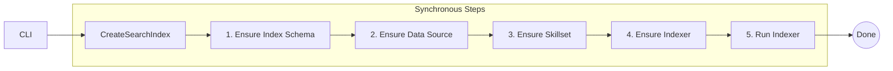

# Azure AI Search – Index Pipeline Builder – Design Document

## 1. Purpose  

Provide a **straight-forward, secure, and idempotent** Python CLI that provisions and runs an indexing pipeline in Azure AI Search for RAG scenarios. Unlike the plug-in-heavy Data Generator, this tool is a *single synchronous workflow* encapsulated in one class.

## 2. Design Principles  

1. **Security first** – `DefaultAzureCredential`; secrets via ENV / Key Vault.
1. **Simplicity** – One class, clear sequential steps, synchronous calls.
1. **Idempotence** – Re-runs update resources, never create duplicates.
1. **Operational Excellence** – Structured logging, deterministic exit codes.
1. **Cost Awareness** – Skip creation when resources are unchanged.

## 3. High-Level Architecture  



There is **no background thread** or async I/O – each step completes before the next one starts.

## 4. Folder & Package Structure  

| Path                                  | Purpose                               |
|---------------------------------------|---------------------------------------|
| `src/create_ai_search_index/__init__.py` | Export `CreateSearchIndex` & version  |
| `src/create_ai_search_index/engine.py`   | `CreateSearchIndex` implementation    |
| `src/create_ai_search_index/cli.py`      | CLI argument parsing & hand-off       |
| `src/create_ai_search_index/__main__.py` | `python -m create_ai_search_index` entry |
| `src/create_ai_search_index/docs/`       | User & design docs (this file)        |

## 5. Class Design  

### 5.1 Class CreateSearchIndex

```python
class CreateSearchIndex:
    """
    Synchronous builder that assembles an Azure AI Search pipeline and runs it.
    """

    def __init__(self, cfg: Config, *, credential: TokenCredential):
        self.cfg = cfg
        self.cred = credential
        # ...existing code (REST client init, logging)...

    # -- Public façade ------------------------------------------------------
    def run(self) -> None:
        """Entry-point called by CLI."""
        self._ensure_index_schema()
        self._ensure_data_source()
        self._ensure_skillset()
        self._ensure_indexer()
        self._run_indexer()

    # -- Private helpers ----------------------------------------------------
    def _ensure_index_schema(self) -> None: ...
    def _ensure_data_source(self) -> None: ...
    def _ensure_skillset(self) -> None: ...
    def _ensure_indexer(self) -> None: ...
    def _run_indexer(self) -> None: ...
```

Key notes:

- **Sequential** – Each `_ensure_*` method blocks until the request finishes.  
- **Retry-aware** – HTTP calls wrapped with simple exponential back-off.  
- **Destructive mode** – If `--delete-existing`, `run()` first tears down the pipeline in reverse order.

### 5.2 CLI Flow

The `cli.py` module handles command-line argument parsing and validation. It uses `argparse` to define the CLI interface and `Config` dataclass to encapsulate the configuration.

1. Parse args (argparse).  
1. Convert to `Config` dataclass.  
1. Instantiate `CreateSearchIndex(config, credential)` and call `.run()`.  
1. Propagate any unhandled exceptions with non-zero exit code.

## 6. Workflow Example  

```bash
python -m create_ai_search_index \
  --storage-account contosodata \
  --storage-container kb \
  --search-service contoso-search \
  --index-name kb-idx \
  --delete-existing true
```

Execution order:

1. Validate credentials & endpoint reachability.  
1. Delete existing index + pipeline (if flagged).  
1. Re-create index schema → data source → skillset → indexer.  
1. Trigger indexer, poll until success or fatal error.  
1. Exit `0` on success; otherwise print reason and exit `1`.

## 7. Error Handling & Logging  

| Type                  | Strategy                                        |
|-----------------------|-------------------------------------------------|
| Transient (429 / 503) | Retry with back-off (max 5 attempts)            |
| Permanent (400 / 403) | Abort immediately, log guidance                 |
| Indexer failure       | Poll status; if `error`, dump execution log URL |

Logs are JSON by default (`--log-format console` for human-readable).

## 8. Security Considerations  

| Area       | Control                                                      |
|------------|--------------------------------------------------------------|
| Auth       | `DefaultAzureCredential`; fallback to `AZURE_SEARCH_API_KEY` |
| Secrets    | CLI never echoes keys; recommended to store in Key Vault     |
| Networking | Works with private endpoints; samples include NSG rules      |

## 9. Testing Strategy  

| Layer  | Focus                                                          |
|--------|----------------------------------------------------------------|
| Unit   | Config parsing, JSON payload generation                        |
| Smoke  | Execute against local emulator (Azurite) with Search sandbox   |
| CI     | GitHub Actions: lint (`ruff`), type (`mypy`), tests (`pytest`) |

## 10. Future Enhancements  

1. Add **async** mode to speed large index populations.  
1. Support **delta indexing** via blob change feed.  
1. Optional **semantic-ranker** configuration file validation.

---
