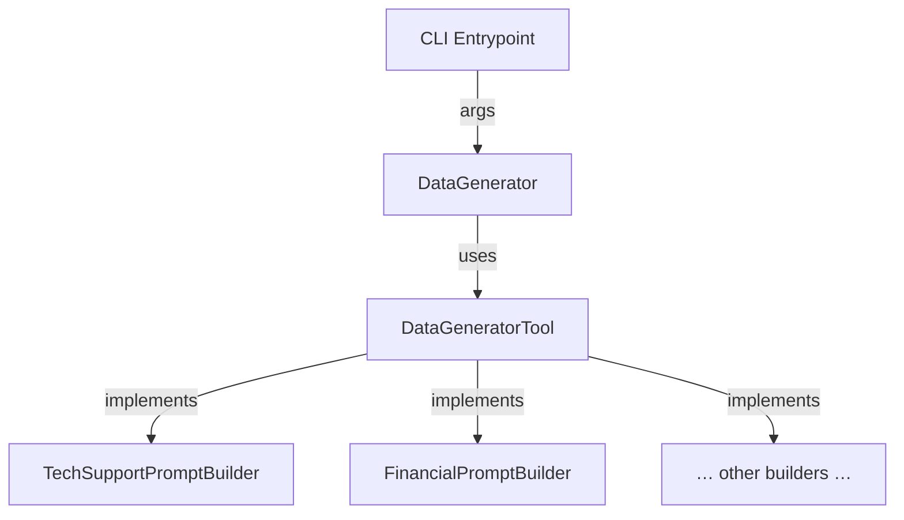

# Synthetic Data Generator – Design Document

## 1. Purpose  

Provide a reusable, secure, and easily extensible Python CLI for generating scenario-specific synthetic data with Azure OpenAI and the Semantic-Kernel SDK. The tool will be used by the **Microsoft Foundry Jumpstart Solution Accelerator** to seed demonstration environments, but maybe used for general synthetic data generation.

This tool is intended to superceed the version found in [/scripts/data-generators/](/scripts/data-generators/), but refer back to that for the original implementation, especially around Semantic Kernel usage.

## 2. Design Principles  

1. **Separation of Concerns** – Prompt construction is isolated from execution.  
2. **Extensibility** – New scenarios require *zero* changes to the core engine; simply add a new `PromptBuilder`.  
3. **Testability** – Pure-logic prompt builders can be unit-tested without calling Azure OpenAI.  
4. **Security first** – Follows Zero-Trust & Azure WAF guidance: no secrets in code, uses Managed Identity by default.  
5. **Operational Excellence** – Structured logging, deterministic outputs, idempotent behaviour, and GitHub Actions CI.  
6. **Cost Awareness** – Parallelism is configurable; token budgets enforced per scenario.

## 3. High-Level Architecture



### 3.1 Components

| Component | Responsibility | Key Methods |
|-----------|----------------|-------------|
| `DataGenerator` | – Load env vars<br/>– Build SK kernel<br/>– Parse CLI args<br/>– **Configure & emit structured logs**<br/>– Concurrency / I/O<br/>– Persist data | `run()`, `_create_kernel()`, `create_prompt_function()`, `generate_data()` |
| `DataGeneratorTool` | – Provide scenario metadata & prompt(s)<br/>– Declare **supported output-formats**<br/>– Declare/validate CLI arguments<br/>– Supply usage examples<br/>– Optional post-processing of model output | `build_prompt()`, `supported_output_formats()`, `cli_arguments()`, `validate_args()`, `examples()`, `get_system_description()`, `post_process()` |

### 3.2 Folder & Package Structure

The project follows the **“src-layout”** pattern recommended by Python Packaging
Authority (PyPA) and embraces a clean separation between **library code**,
**CLI/utility scripts**, **infrastructure templates**, and **tests**.

| Path | Purpose | Key Notes |
|------|---------|-----------|
| `src/data_generator/` | Core Python package (`import data_generator`) | Dash (`-`) replaced by underscore in importable package name; `__init__.py` exposes public API. |
| `src/data_generator/tools/` | Scenario-specific prompt builders | Each file defines one `DataGeneratorTool` subclass and registers itself for dynamic discovery. |
| `src/data_generator/cli.py` | CLI entry-point wired in `pyproject.toml` | Keeps console scripts thin; delegates all logic to `DataGenerator`. |
| `src/data_generator/pyproject.toml` | Single source of truth for build, dependencies & tooling config | Uses PEP 621 metadata; `ruff`, `black` and `mypy` configured here. |

Implementation best-practice highlights  
• **Isolated imports** – anything outside `src/` is never on `sys.path` during
  unit tests, preventing accidental implicit dependencies.  
• **Explicit exports** – `__all__` defined in `data_generator/__init__.py` to
  keep the public surface minimal.  
• **Typed packages** – a `py.typed` marker file ships with the wheel so
  downstream consumers benefit from type hints.  
• **Tests are first-class** – `pytest` collects from `tests/` only; fixtures
  ensure Azure calls are mocked unless an explicit `--live` flag is set.  
• **Tooling consistency** – all lint/format/type-check rules live in
  `pyproject.toml`, ensuring IDEs and CI share one configuration source.

## 4. Class Design

### 4.1 Class DataGenerator

```python
class DataGenerator:
    """
    Orchestrates end-to-end generation. It wires a DataGeneratorTool into the
    Semantic-Kernel runtime, **handles structured logging**, and exposes a simple
    `run()` façade for the CLI.
    """

    def __init__(self, tool: "DataGeneratorTool", *, log_level: str = "INFO") -> None:
        self.tool = tool
        # ...existing code (env load, kernel init, logging)...

    # previously abstract – now provided as a skeletal default implementation
    def generate_data(
        self,
        count: int,
        out_dir: Path,
        output_format: str = "json",
    ) -> None:
        """
        Core generation loop. Concrete tools can still override for
        scenario-specific needs, but a sensible default exists.
        """
        prompt = self.tool.build_prompt(output_format)
        prompt_fn = self.create_prompt_function(
            template=prompt,
            function_name="generate",
            plugin_name=self.tool.name,
            prompt_description=f"{self.tool.name} generator",
            input_variables=[{"name": "index", "description": "record ordinal"}],
            max_tokens=2048,
        )
        for i in range(1, count + 1):
            raw = prompt_fn(index=i)
            processed = self.tool.post_process(raw)
            # ...existing code to persist processed data...
```

Key implementation notes  
• `generate_data()` now ships with a default loop, so `DataGenerator` is **no longer abstract**.  
• Scenario-specific overrides remain optional for advanced requirements.

### 4.2 Abstract Class DataGeneratorTool

```python
class DataGeneratorTool(ABC):
    name: str  # unique id for discovery

    # --- Prompt construction ------------------------------------------------
    @abstractmethod
    def build_prompt(self, output_format: str) -> str: ...

    # --- Output-format contract --------------------------------------------
    def supported_output_formats(self) -> list[str]:
        """
        Return the list of output formats this tool supports,
        e.g. ["json", "csv", "yaml"].  Defaults to ["json"].
        """
        return ["json"]

    # --- CLI argument contract ---------------------------------------------
    def cli_arguments(self) -> list[dict]: ...          # arg spec for argparse/click
    def validate_args(self, ns) -> None: ...            # raise on invalid combos
    def examples(self) -> list[str]: ...                # usage snippets for help text
    def get_system_description(self) -> str: ...
    def post_process(self, raw: str): ...
```

### 4.3 Concrete Subclass DataGeneratorTools

Example: `TechSupportPromptBuilder`, `FinancialTransactionsPromptBuilder`, `HealthcarePromptBuilder`, etc. They only implement the abstract members and optionally define CLI-specific extra flags via a mix-in.

### 4.4 Interfaces in Python

`DataGeneratorTool` acts as the interface while still allowing  
shared helper logic (e.g., a default `post_process`).  Any concrete prompt builder  
must subclass it and implement the abstract methods; otherwise, instantiation raises  
`TypeError`.  This approach is Pythonic, static-type friendly (mypy/pyright) and keeps  
the public contract explicit.

## 5. CLI Workflow

1. User calls:  
   `python -m ai_foundry_gen --scenario tech_support --count 500 --out-dir ./data`
2. CLI loads builder class by `name`.
3. `DataGenerator(builder).run()` is invoked.
4. Engine spawns async tasks, calls SK, collects outputs, runs `builder.post_process()` if present.
5. Data saved in `out-dir` as JSON/CSV/Parquet (user selectable).

### 5.1 Example CLI Calls

```bash
# 1. Generate ten tech-support records (default JSON)
python -m generate_data \
  --scenario tech-support \
  --count 10 \
  --out-dir ./sample-data/tech-support
  --output-format yaml

# 2. Produce 1 000 financial transactions as CSV in a custom folder
python -m generate_data \
  --scenario financial \
  --count 1000 \
  --out-dir ./sample-data/financial-transactions/csv \
  --output-format csv \
  --transaction-type credit-card \
  --transaction-count-max 25

# 3. Healthcare generator with scenario-specific arg ‑-speciality
python -m generate_data \
  --scenario healthcare \
  --count 250 \
  --speciality 'cardiology'
```

### 5.2 Environment Configuration (.env vs CLI)

The generator reads connection settings from a standard **dotenv** file located  
next to the executing script *or* at the repository root:

```dotenv
AZURE_OPENAI_ENDPOINT   = "https://<your-rg>.openai.azure.com"
AZURE_OPENAI_DEPLOYMENT = "gpt-4-1"
```

Precedence order when resolving values:

1. Explicit CLI flags `--openai-endpoint` and `--openai-deployment`.
2. Environment variables already present in the shell.
3. Values loaded from `.env` (and optional scenario-specific override files).

Example with explicit overrides:

```bash
python -m generate_data \
  --scenario tech-support \
  --count 50 \
  --azure-openai-endpoint https://datagenerator.openai.azure.com \
  --azure-openai-deployment gpt-4-1
```

If neither CLI flags nor variables are found, startup fails with a clear
`EnvironmentError`, ensuring credentials are never implicitly guessed.

### 5.3  Run in-place (no install)

```powershell
# Repo root
cd D:\source\GitHub\PlagueHO\microsoft-foundry-jumpstart

# Expose the src-layout for the current shell only
$env:PYTHONPATH = "$PWD\src"

# Invoke the CLI
python -m data_generator `
  --scenario tech-support `
  --count 50 `
  --system-description "ContosoShop – React SPA front-end with Azure App Service + SQL back-end" `
  --output-format yaml `
  --out-dir .\data\tech_support
```

Linux/WSL:

```bash
export PYTHONPATH="$PWD/src"
python -m data_generator --scenario tech-support ...
```

## 6. Extensibility Guide

1. Create new file `ai_foundry_gen/prompts/my_scenario.py`.
2. Subclass `DataGeneratorPromptBuilder`, set `name = "my_scenario"`.
3. Implement `build_prompt()`, optionally add `post_process()`.
4. Register in `ai_foundry_gen/prompts/__init__.py` (or use importlib discovery).
5. Add example unit tests under `tests/prompts/`.

## 7. Error Handling & Logging

- Uses Python `logging` with color output via Colorama.  
- All Azure SDK calls wrapped with exponential back-off retry (Tenacity).  
- Errors in individual records are logged and skipped; run summarises failure count.

## 8. Security Considerations

| Area | Approach |
|------|----------|
| Credentials | Prefer `DefaultAzureCredential`; fall back to env var `AZURE_OPENAI_API_KEY`. |
| Networking | Private endpoints recommended; doc links included. |
| Data Residency | Region selectable via env var. |
| Output Sanitisation | Builders must ensure no PI/PHI is emitted (use synthetic only). |

## 9. Testing Strategy

| Layer | Tooling | Focus |
|-------|---------|-------|
| Unit   | pytest  | Prompt builders, post-processing logic |
| Integration | pytest-asyncio | DataGenerator end-to-end using mocked SK service |
| Linting | ruff / mypy | Style, type safety |
| CI | GitHub Actions | On PR: lint, unit, integration (w/ Azure OpenAI live only in nightly) |

## 10. Release & Deployment Pipeline

• Tagged releases publish to PyPI (internal feed) and create GitHub Release notes.  
• Docs (this repo) built with MkDocs and hosted in Azure Static Web Apps.  
• Versioning follows SemVer; SDK versions pinned with Renovate.

## 11. Future Enhancements

1. Add optional **streaming** generation mode for very large datasets.  
2. Plug-in architecture for non-OpenAI models (HuggingFace, OSS) behind same interface.  
3. Provide PowerShell wrapper aligning with AVM deployment pipelines.

## 12. Patterns & Practices

### 12.1  Async-first Design  

- The default `DataGenerator.generate_data()` implementation will expose an **async variant** (`generate_data_async`) that utilises `asyncio.gather` for concurrent prompt invocations.  
- All I/O (e.g. file writes, network calls) should leverage non-blocking libraries (`aiofiles`, `httpx`, etc.) where practical.  
- Long-running synchronous CPU work is delegated to a thread-pool via `asyncio.to_thread` to avoid blocking the event loop.

### 12.2  Clean Code Guidelines

1. **Type Hints Everywhere** – Enforced with `mypy --strict`.  
2. **Single Responsibility** – Each class/module does one job; prompt builders do not perform I/O.  
3. **Dependency Injection** – Kernel, credentials and loggers are passed in, not created ad-hoc.  
4. **Fail Fast, Fail Loud** – Use explicit `ValueError`, `EnvironmentError`, etc. with actionable messages.  
5. **Context Managers** – Ensure deterministic cleanup of files/async resources.  
6. **Docstrings & PEP 257** – Every public symbol is documented; Google style preferred.  
7. **Immutable Defaults** – Never use mutable default arguments; favour `None` + factory.  
8. **Configuration via `pyproject.toml`** – Tooling (ruff, mypy, pytest) lives in a single canonical file.

### 12.3  Linting & Formatting

- **ruff** (`ruff check .`) for lint + import sorting.  
- **black** (`black .`) for formatting.  
- **isort** integrated in ruff profile to keep import order deterministic.

### 12.4  Error & Log Handling  

- Use `structlog` (or standard `logging` with JSON formatter) for machine-readable logs.  
- Correlate async tasks with `task_id` in log context to aid troubleshooting.  
- Sensitive values (keys, tokens) are never logged.

### 12.5  Packaging & Versioning

- Library code lives under `src/data_generator/`; CLI entry point is declared in `pyproject.toml` (`[project.scripts]`).  
- Semantic versioning (`MAJOR.MINOR.PATCH`) with automated bump & changelog via GitHub Actions.

### 12.6  Testing Conventions

- **pytest-asyncio** for async unit tests.  
- Fixtures provide mocked SK kernels to avoid calling Azure in unit scope.  
- 90 %+ branch coverage gate enforced in CI (`pytest --cov --cov-fail-under=90`).
